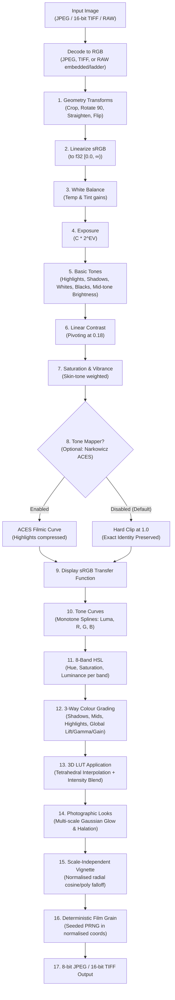

# Editing — development plan

> **Round 1 built (ED-1–ED-8); Round 2 planned (ED-9–ED-18).**
> Where the Round 1 build diverged from this plan the text has been corrected in place and
> the rationale recorded in [`docs/phase-reports/edit.md`](phase-reports/edit.md).
> Round 2 specifies advanced photographic adjustments, tone curves, 8-band HSL,
> colour grading wheels, geometry, film grain, looks, and workflow presets.

Non-destructive photographic adjustments for individual frames on the desktop, and bulk 3D LUT
grading for folders.

A photograph captured on an SD card or scanned from film frequently requires basic exposure and
white balance adjustment, or a creative film simulation LUT, before it is ready for border framing,
contact sheets, or publishing. This tool adds non-destructive editing and folder-scale LUT
application directly into PhotoTools.

Steps have stable ids (`ED-4`), the same way [`manual-verification.md`](manual-verification.md)
numbers its checks, so one can be named in a commit or a conversation.

---

## The flow, as the screen presents it

Two desktop screens, separating single-frame refinement from batch grading.

### 1 · Single-image editor (`frontend/desktop/src/views/Edit.vue`)
A dedicated desktop workspace for tuning one photograph at a time:
- **Viewport**: The photograph presented against an isolated, true neutral 18% grey surround
  (`var(--canvas-surround)`), free of CRT scanlines (`var(--z-canvas)` sits above scanlines at 50,
  and beneath navigation at 200).
- **Side panel**: Grouped parametric sliders for White Balance (temperature, tint), Exposure,
  Highlights/Shadows (strictly anchored at mid-grey), Contrast, and Vibrance/Saturation, plus a
  3D LUT selector with an intensity slider (0–100%).
- **Interactive control**: Double-click any slider label to reset to 0.0 (exact identity). Press `\`
  or hold the "Before / After" toggle to compare against the unadjusted input.
- **Saving**: Edits are stored non-destructively in a lightweight `<file name>.photoedit` JSON
  sidecar (e.g. `IMG_0001.JPG.photoedit` alongside `IMG_0001.JPG`, ensuring RAW and JPEG pairs
  never share one). Card media is detected at its mount point by walking up ancestors until the
  filesystem device ID (`MetadataExt::dev` on Unix) changes and testing `Card::at(volume_root).looks_like_a_card()`
  (checking for a root `DCIM` directory); if the file resides on a card volume, the editor operates
  in **Read-Only Mode** (G5). A library folder holding a copied `DCIM` tree is not a card.
  Mounted shares (such as the NAS library) without `DCIM` at their mount root remain writable.
- **Exporting**: An explicit "Export Render" button bakes the recipe to a full-resolution JPEG or
  TIFF:
  - **Naming**: Appends `_edit` to the stem (e.g. `IMG_0001_edit.jpg`).
  - **Destination**: Defaults to the source file's directory, or an explicit user-selected folder.
  - **Collision rule**: **Never overwrite.** Uses exclusive file creation (`OpenOptions::create_new(true)`):
    attempts `<stem>_edit.<ext>`, then `<stem>_edit_1.<ext>`, `<stem>_edit_2.<ext>`... atomically,
    preventing race conditions if two exports run concurrently (§9.2 invariant 6).
  - **Safety rule**: Refuses to export directly into the `Publishing` folder (MV-16.7), keeping
    reviewed staging safe, and refuses destinations on a card volume (G5).
  - **Identity copy**: If the recipe is untouched (all sliders at 0.0, no LUT), export performs a
    direct byte-for-byte stream copy to prevent generational JPEG DCT compression loss.

### 2 · Bulk LUT tool (`frontend/desktop/src/views/BulkLut.vue`)
A standard folder tool matching the pattern of F7 (Border) and F8 (TIFF):
- **Input**: Point at a folder of photographs (JPEG, TIFF, or camera RAW).
- **LUT selection**: Choose a 3D LUT from the managed LUT library (`.cube`, `.3dl`, or HALD `.png`)
  and set intensity (0–100%).
- **Multi-sample preview**: Previews the LUT effect across 3–5 representative frames spread
  throughout the folder before committing.
- **Output destination**: Choose an output directory. Refuses to write directly into `Publishing`
  (MV-16.7).
- **Execution**: Runs as a background job with progress reporting, cancellable at any time. All
  camera EXIF, capture dates, and GPS coordinates are preserved onto the output files via the
  persistent `ExifWriter`.

### Pure shared controls
Slider and picker components (`AdjustmentSlider.vue`, `LutPicker.vue`) live in
`frontend/shared/src/ui/components/`. Version 1 is **desktop-only**: no web routes are mounted,
and no `ApiClient` transport method is declared that one transport would throw for.

---

## Status of this work against the specification

**`SPECIFICATION.md` does not mention image adjustments, exposure compensation, or LUTs.**
Like `tools::geotag` and `tools::timeline`, this feature is outside the specification. No F-number
is invented (G11); the specification is not edited (G9).

### Ground rules compliance

| Rule | Enforcement in this plan |
|---|---|
| **G1** | The adjustment recipe, color math, LUT parser, and CPU renderer live strictly in `phototools-core` (`media::edit` and `tools::lut`). Binary crates hold only Tauri IPC transport. |
| **G2** | All rendering and LUT parsing compiles and passes unit tests in `crates/core` with **no binary crate present**. Card volume detection lives in `core` so G5 refusal is testable in isolation. |
| **G3 / G4** | Metadata reads remain in-process via `nom-exif`. Derivatives inherit capture dates, camera tags, and GPS coordinates through `tools::carry_metadata` via the persistent `ExifWriter`. |
| **G5** | **Never write to a source SD card.** The editor detects camera cards by finding the volume root at the mount point (via device ID change) and checking whether it contains a `DCIM` directory (`Card::looks_like_a_card()`, F10), refusing to write sidecars on card volumes. Mounted shares (such as NAS SMB shares) without `DCIM` at their mount root remain writable. Bulk LUT and Export require an explicit destination folder outside any card volume. |
| **G6** | Every input, output, and LUT file path is canonicalised and validated against configured roots. |
| **G7** | No test is weakened. Identity adjustments and zero-intensity LUTs must produce identical output. |
| **G8** | **Zero new runtime dependencies for CPU rendering.** `image`, `rayon`, `rawler`, `mozjpeg`, `tiff`, and `fast_image_resize` are already in `core`. RAW decoding delegates to the existing ladder in `media::raw` (not `ingest::derivation`, as `media` must never depend on `ingest`). RapidRAW's AGPL code is rejected; only public specifications (Adobe `.cube`) are used. `wgpu` is deferred. On the desktop frontend, `playwright` is added as a devDependency pinned to the exact version (`1.62.1`) matching `frontend/web` so that headless acceptance testing (`check:edit`) reuses the pre-installed Chromium build without downloading new browser binaries. |
| **G9** | `SPECIFICATION.md` is not edited. |
| **G10** | No `unimplemented!()`, `todo!()`, or swallowed errors on shipped paths. |
| **G11** | The scope is strictly the requested adjustments and bulk LUT grading. Carrying `.xmp` sidecars is excluded. |

---

## Decisions already taken

| Decision | Rationale & consequence |
|---|---|
| **CPU-first authority** | A multithreaded CPU pipeline in `core` using `rayon` is the authority for exports and CI tests. `wgpu` is deferred to keep dependencies clean (G8) and avoid GPU driver requirements in headless CI environments. |
| **RAW decoded through media::raw ladder** | Camera RAW inputs are decoded using `media::raw` (not `ingest::derivation`, preserving modularity since `media` must never depend on `ingest`). In v1, the ladder yields an 8-bit JPEG (often the camera's embedded preview); thus v1 edits the camera's rendering, not sensor data, and has no headroom above the camera's clipping point. |
| **Display-encoded LUT application** | Tone and exposure adjustments occur in **linear light**. Values are hard-clipped at display white ($[0.0, 1.0]$) to preserve exact identity under identity recipes, and sRGB transfer is applied *before* the 3D LUT, because creative `.cube` LUTs expect display-referred inputs. Inputs are clamped to `DOMAIN_MIN`/`DOMAIN_MAX`. |
| **Crossover at 0.18 for tones** | Mid-grey ($0.18$) is strictly stationary. Shadows' weight falls to exactly zero at $0.18$; Highlights' weight rises from zero at $0.18$. Adjusting highlights or shadows leaves an 18% grey card untouched. |
| **Card detection at mount point** | A card volume is identified at its mount point by walking up ancestors to the volume root (`MetadataExt::dev` boundary on Unix) and verifying `Card::at(volume_root).looks_like_a_card()` (case-insensitive `DCIM`). We do not check every ancestor for `DCIM` (a library folder holding a copied `DCIM` tree is not a card). macOS mounts of NAS SMB shares without `DCIM` at their mount root remain fully editable while camera cards remain strictly read-only (G5). |
| **Single-image export rules** | Exports append `_edit`, never overwrite existing files (incrementing `_edit_1`, `_edit_2` atomically via `create_new(true)`), refuse destinations inside `Publishing` (MV-16.7, resolved at command layer) or on cards (G5), and stream copy identity recipes directly without re-compression. |
| **Interactive proxy & binary IPC** | Slider adjustments re-render a 720p proxy during active mouse drag via raw binary IPC, settling to a 1440p render on release. Core preview rendering is budgeted and verified in ED-4; binary IPC protocol is built in ED-6; end-to-end slider-to-paint responsiveness is measured in ED-7. |
| **Sidecar & Rename harmony** | F3 Rename carries companion `<file name>.photoedit` files with the parent image in two steps: in plan, the sidecar is not a standalone item and an existing target sidecar is a planned conflict; in apply, the photo is renamed then the sidecar is renamed (re-checking existence), reporting sidecar rename failures against the photo (G10). Carrying `.xmp` is excluded (G11). Recipes store `source_sha256` for detached verification. |
| **Managed LUT library** | Recipes reference LUTs by content hash (`sha256`) and filename, resolving against a managed LUT root under configured paths (G6), avoiding fragile absolute paths. |
| **Identity export byte copy** | Exporting an image with zero adjustments performs a byte-for-byte stream copy, avoiding generational JPEG DCT compression loss. |
| **Desktop-only v1 scope** | Both screens live in `frontend/desktop/src/views/`, avoiding unbacked `ApiClient` routes on the web. |
| **Multi-sample pre-flight preview** | In Bulk LUT, 3–5 representative frames spread throughout the folder are rendered before committing to the batch. The background job can be cancelled at any time. |
| **Re-editing after publishing** | Google Photos deduplication keys on file content hash (`key_kind = "file"`). Re-editing an already published photograph creates a new file hash, which uploads as a second copy. The dry run must explicitly state this. |

---

## Color and adjustment pipeline architecture

All color transformations occur in `crates/core/src/media/edit/`:

```mermaid
flowchart LR
    Input["Input Image<br>(JPEG / 16-bit TIFF / RAW)"] --> Decode["Decode to RGB<br>(JPEG, TIFF, or RAW via media::raw ladder)"]
    Decode --> Linear["Linearize sRGB<br>(to f32 [0.0, ∞))"]
    Linear --> WB["1. White Balance<br>(Temp & Tint gains)"]
    WB --> Exp["2. Exposure<br>(C * 2^EV)"]
    Exp --> Tone["3. Highlights & Shadows<br>(Crossover at 0.18; 0.18 strictly stationary)"]
    Tone --> Contrast["4. Contrast<br>(Power curve pivoting at 0.18)"]
    Contrast --> Sat["5. Saturation & Vibrance<br>(Skin-tone weighted)"]
    Sat --> Display["6. Gamut Clamp & sRGB Transfer<br>(to [0.0, 1.0])"]
    Display --> LUT["7. 3D LUT Application<br>(Tetrahedral + Intensity blend)"]
    LUT --> Output["8-bit / 16-bit Encoded Output"]
```



### 1. Adjustment definition (`AdjustmentRecipe`)

```rust
#[derive(Debug, Clone, PartialEq, Serialize, Deserialize)]
pub struct LutRef {
    pub name: String,
    pub sha256: String,
}

#[derive(Debug, Clone, PartialEq, Serialize, Deserialize)]
pub struct AdjustmentRecipe {
    pub version: u32,
    /// SHA-256 of the source image file at the time of recipe creation.
    pub source_sha256: String,
    /// Exposure compensation in EV stops: -5.0 to +5.0 (0.0 = identity).
    pub exposure: f32,
    /// White balance temperature shift: -100.0 to +100.0.
    pub temperature: f32,
    /// White balance tint shift: -100.0 to +100.0.
    pub tint: f32,
    /// Highlight recovery / boost: -100.0 to +100.0 (anchored, leaves 0.18 untouched).
    pub highlights: f32,
    /// Shadow lifting / crushing: -100.0 to +100.0 (anchored, leaves 0.18 untouched).
    pub shadows: f32,
    /// Contrast: -100.0 to +100.0 (power curve pivoting at 0.18, clipped at white by display transfer).
    pub contrast: f32,
    /// Global saturation: -100.0 to +100.0.
    pub saturation: f32,
    /// Vibrance (smart saturation protecting saturated tones): -100.0 to +100.0.
    pub vibrance: f32,
    /// Optional portable reference to a 3D LUT.
    pub lut: Option<LutRef>,
    /// LUT blend factor: 0.0 to 1.0 (1.0 = 100% LUT effect).
    pub lut_intensity: f32,
}

impl Default for AdjustmentRecipe {
    fn default() -> Self {
        Self {
            version: 1,
            source_sha256: String::new(),
            exposure: 0.0,
            temperature: 0.0,
            tint: 0.0,
            highlights: 0.0,
            shadows: 0.0,
            contrast: 0.0,
            saturation: 0.0,
            vibrance: 0.0,
            lut: None,
            lut_intensity: 1.0,
        }
    }
}
```

### 2. Mathematics of operations

1. **Decoding & Linearization**:
   Input files are decoded to RGB (camera RAWs decode through `media::raw`'s ladder, keeping `media` independent of `ingest`). Values are converted to linear light:
   $$C_{lin} = \begin{cases} \frac{C_{srgb}}{12.92} & C_{srgb} \le 0.04045 \\ \left(\frac{C_{srgb} + 0.055}{1.055}\right)^{2.4} & C_{srgb} > 0.04045 \end{cases}$$
2. **White balance & exposure**:
   Applies channel gains and optical exposure scaling:
   $$C = C_{lin} \times \text{gain}_{wb} \times 2^{\Delta EV}$$
3. **Crossover highlights & shadows (0.18 stationary)**:
   Mid-grey ($Y = 0.18$) is strictly stationary. The tonal curves are defined so their weights do not overlap across mid-grey:
   - **Highlights weight $w_H(Y)$**: exactly $0$ for $Y \le 0.18$. For $Y > 0.18$, rises smoothly (cubic Hermite) reaching full effect by $Y = 0.65$.
   - **Shadows weight $w_S(Y)$**: exactly $0$ for $Y \ge 0.18$. For $Y < 0.18$, rises smoothly reaching full effect by $Y = 0.05$.
   At $Y = 0.18$, $w_H = 0$ and $w_S = 0$, guaranteeing that mid-grey is never modified by either slider. Proved by unit test `highlights_and_shadows_leave_mid_grey_untouched`.
4. **Contrast & vibrance**:
   Contrast applies a power curve pivoting at $0.18$ ($(Y / 0.18)^{0.5 \cdot c}$, clipped at white by step 6), not a sigmoid S-curve. Vibrance scales chroma inversely to existing saturation: $(1 - S) \times \Delta V$.
5. **Display transfer & bounds clamping**:
   Values are hard-clipped at display white ($[0.0, 1.0]$) and converted back to display sRGB. v1 deliberately clips rather than applying a filmic tone-mapping shoulder to preserve exact numerical identity under identity recipes. +EV clips highlights that were near white; the Highlights slider is the mechanism to pull them back (acting on $Y > 0.18$ up to full effect at $0.65$, before the display clip):
   $$C_{disp} = \begin{cases} 12.92 C & C \le 0.0031308 \\ 1.055 C^{1/2.4} - 0.055 & C > 0.0031308 \end{cases}$$
6. **3D LUT evaluation (display space)**:
   Input values are clamped to the LUT's declared `[DOMAIN_MIN, DOMAIN_MAX]` (defaulting to $[0.0, 1.0]$). Tetrahedral interpolation samples the four enclosing lattice vertices to compute $C_{lut}$. The result is blended linearly:
   $$C_{final} = (1 - \text{intensity}) \times C_{disp} + \text{intensity} \times C_{lut}$$

---

## User experience and interface design

### 1. Scanline isolation and neutral surround
- **Canvas surround token**: `--canvas-surround: #767676` is declared in `frontend/shared/src/ui/styles/tokens.css`. This is true 18% photographic grey ($L^*=50$), preventing chromatic adaptation illusions. In light mode (`[data-theme='light']`), `--canvas-surround` remains `#767676`, because 18% reflectance is an absolute perceptual reference regardless of application chrome.
- **Canvas z-index token**: `--z-canvas: 60` is declared in `tokens.css`. It lifts the photograph above global CRT scanlines (`--z-scanlines: 50`) while remaining safely beneath status overlays (`--z-status: 100`) and navigation (`--z-nav: 200`).

### 2. Control safety and reversibility
- **Reset per slider**: Double-clicking any slider label immediately restores it to `0.0`.
- **Before/After toggle**: Hotkey `\` or holding the comparison button switches the viewport to the unadjusted source.
- **Card media safety banner**: When opening an image from a volume whose root contains a `DCIM` directory (F10), the UI activates a banner: *"Card media is read-only (G5). Copy files to a working folder to save edits."*

### 3. Multi-sample bulk LUT pre-flight feedback
- In `/tools/lut`, selecting a folder extracts 3–5 representative frames across the roll and renders a preview strip at the selected LUT intensity before processing.
- Progress reporting displays: `X rendered, Y skipped, Z failed`, with immediate cancellation support.

---

## Steps

### `ED-1` · Color and adjustment engine in `core`
- Create `crates/core/src/media/edit/mod.rs` and `pipeline.rs`.
- Implement exact sRGB $\leftrightarrow$ Linear float conversions (table lookup optimization deferred to ED-4).
- Wire camera RAW decoding directly to `media::raw` (`crates/core/src/media/raw.rs`), preserving the invariant that `media` never depends on `ingest`.
- Implement exposure, white balance, contrast, anchored highlights/shadows, and vibrance algorithms.
- **Tests**:
  - `an_untouched_recipe_is_exact_identity`
  - `exposure_plus_one_doubles_linear_luminance`
  - `highlights_and_shadows_leave_mid_grey_untouched`

### `ED-2` · 3D LUT parser and tetrahedral interpolator
- Create `crates/core/src/media/edit/lut.rs`.
- Implement clean-room parser for Adobe `.cube`, `.3dl`, and square HALD `.png`.
- Honour `DOMAIN_MIN` and `DOMAIN_MAX`. Handle out-of-range inputs before interpolation.
- Implement tetrahedral interpolation in display-encoded space.
- **Tests**:
  - `a_lut_is_sampled_with_display_encoded_values_not_linear_ones`
  - `an_identity_cube_returns_exact_input_values`
  - `lut_intensity_zero_returns_pre_lut_image`
  - `lut_intensity_half_blends_fifty_percent`

### `ED-3` · Sidecar serialization, F3 rename, card safety, and export rules
- Implement `<file name>.photoedit` JSON serialization with `source_sha256` and versioning (e.g. `IMG_0001.JPG.photoedit` so RAW and JPEG pairs do not share one). Write sidecars atomically via a temporary file in the same directory. Reject unknown future versions clearly. Refuse to save sidecars for nonexistent images (G10).
- Extend `F3 Rename` (`crates/core/src/tools/f3_rename.rs`) to carry companion `.photoedit` files in two steps: in plan, record the companion sidecar in the planned action, the sidecar is not a standalone item, and an existing target sidecar is a planned conflict; in apply, re-check both photo and sidecar targets before moving either, then rename photo followed by sidecar, reporting sidecar rename failures against the photo in the summary (G10).
- Enforce G5: Implement card volume detection in `core` (`tools::edit`): find the volume root at the mount point (`MetadataExt::dev` boundary on Unix) and check `Card::at(volume_root).looks_like_a_card()`. Make root-finding injectable for testing. Prohibit sidecar writes and export destinations on card volumes; allow writes on mounted shares without `DCIM`.
- Implement single-image export rules (`export_edited_image(source, recipe, lut, out_dir)`): `out_dir` must already be resolved by the caller with `resolve_output` (enforcing G6 roots and MV-16.7 Publishing refusal at the command/API layer). Core refuses destinations on cards (G5). Append `_edit` suffix with atomic exclusive create (`create_new(true)` checking `_edit`, `_edit_1`, `_edit_2`...). Perform direct byte copy on identity recipes. Refuse recipes whose requested LUT is missing. Encode to memory first so failed encodes leave no file behind. Encode 16-bit TIFFs as 16-bit TIFF, everything else as JPEG (quality 95). Carry metadata with `carry_metadata(..., upright: false)` and report skips.
- *Orientation note*: `decode_image` does not apply EXIF orientation. This is consistent only if export keeps the orientation tag and pixels together (`carry_metadata` with `upright: false`).
- **Tests**:
  - `a_sidecar_is_named_after_the_whole_file_so_raw_and_jpeg_pairs_do_not_share_one`
  - `a_sidecar_round_trips_and_a_future_version_is_refused`
  - `a_sidecar_is_written_atomically`
  - `editor_refuses_to_save_a_sidecar_for_a_nonexistent_image`
  - `f3_rename_carries_companion_photoedit_sidecar`
  - `f3_rename_plans_a_conflict_when_the_sidecar_target_exists`
  - `f3_rename_reports_a_sidecar_that_could_not_follow_its_photo`
  - `editor_refuses_to_write_a_sidecar_on_a_card_volume`
  - `a_mounted_share_without_dcim_is_writable`
  - `a_library_folder_containing_a_copied_dcim_is_not_a_card`
  - `export_edited_image_appends_edit_suffix_and_never_overwrites`
  - `exporting_a_recipe_whose_lut_is_missing_is_refused`
  - `a_failed_export_leaves_no_file_behind`
  - `export_refuses_a_destination_on_a_card`
  - `exporting_an_untouched_jpeg_preserves_source_bytes_without_reencoding`
  - `an_exported_jpeg_keeps_its_orientation_tag_and_capture_date`
  - `a_16_bit_tiff_exports_as_a_16_bit_tiff`

### `ED-4` · Proxy preview renderer in core and render budgets
- Implement `PreviewSession` in `crates/core/src/media/edit/preview.rs` holding cached, already-linear proxies: 720p during active dragging (1280 px long edge), settling to 1440p on release (2560 px long edge).
  - *Resolution rationale*: We choose 720p (1280 px long edge, ~1.09 MP for 3:2) for dragging because active scrubbing demands continuous, stutter-free visual motor continuity at 30–60 fps. Rendering 720p executes at **8.2 ms p95** (measured in release on Apple Silicon with a 36 MP frame, tone adjustments, and a 33³ LUT), safely below the 25 ms core render budget and leaving ample headroom for IPC transfer and webview display. The settling 1440p frame (2560 px long edge) renders at **35.5 ms p95** (measured in release on Apple Silicon), restoring full retina sharpness on mouse release within the 60 ms budget.
  - *Downscaling rationale*: We downscale in decoded integer pixel space (`Rgb8` / `Rgb16`) before linearising rather than linearising the 36 MP full-resolution frame first:
    1. *Memory footprint*: Allocating full-frame floating-point buffers for 36 MP consumes ~433 MB RAM; downscaling integer pixels first allocates only ~13 MB (720p) and ~52 MB (1440p) for the cached linear proxies, avoiding memory spikes and cache thrashing.
    2. *Speed & SIMD efficiency*: `fast_image_resize` provides SIMD-accelerated (NEON/AVX2) assembly kernels for `U8x3` and `U16x3` integer resizing. Full session creation (both proxies downscaled and linearised) takes **113 ms** (measured in release on Apple Silicon with a 36 MP frame), well below the ≤ 1 s budget.
    3. *Linearisation efficiency*: Linearising only the two downscaled proxies (~5.4 MP combined) via 256- and 65,536-entry decode lookup tables completely eliminates redundant conversions of discarded full-frame pixels.
  - *Downscaling trade-off*: Averaging in encoded (gamma) space darkens fine high-contrast detail slightly in the **preview**, relative to the export, which renders at full resolution. That is a fair trade for an interactive preview, but documented so nobody mistakes it for a pipeline error when comparing a preview with an export at 100%.
- Implement 256- and 65,536-entry decode lookup tables (`SRGB_TO_LINEAR_U8`, `SRGB_TO_LINEAR_U16`) holding exactly the values of `srgb_to_linear`, used in `LinearBuffer::from_image_buffer` to eliminate per-channel `powf` calls during linearisation.
- Implement `render(recipe, lut, stage) -> Result<RgbaFrame, Error>` outputting RGBA8 ready for canvas `ImageData` without client-side conversion. Refuses missing or mismatched LUTs via shared `validate_lut`.
- Faithfulness: on the same proxy pixels, every channel matches the exact export renderer within ±1 code value with adjustments and a 3D LUT active.
- **Core render benchmark targets and pass/fail measurement**:
  - **Measurement methodology**: Evaluated on a synthetic 36 MP source (7360×4912), one warm pass, then p95 over at least 40 renders with exposure, highlights, contrast, saturation, and a 33³ LUT active.
  - **Drag frame (720p)**: **p95 ≤ 25 ms** (half of ED-7's 50 ms end-to-end budget, as split by the plan's architectural rationale). Measured release figure: **8.2 ms p95** on Apple Silicon.
  - **Settle frame (1440p)**: **p95 ≤ 60 ms** (half of ED-7's 120 ms end-to-end budget). Measured release figure: **35.5 ms p95** on Apple Silicon.
  - **Session creation**: **≤ 1 s** (decode excluded, proxy downscaling and linearisation included). Measured release figure: **113 ms** on Apple Silicon.
  - Asserted under `#[cfg(not(debug_assertions))]`, printed always.
- **Tests**:
  - `decode_tables_match_the_exact_conversion_for_every_code`
  - `rendering_never_changes_the_cached_proxies`
  - `the_preview_matches_the_export_renderer_within_one_code`
  - `a_preview_refuses_a_recipe_whose_lut_is_missing`
  - `a_preview_frame_is_rgba_of_the_proxy_size`
  - `benchmark_edit_preview`

### `ED-5` · Bulk LUT tool in `core::tools`
- Implement `BulkLutTool` in `crates/core/src/tools/lut.rs` conforming to `Tool` trait.
- Refuse output directory on an SD card volume (G5, `is_card_volume`) in `plan()` before anything runs.
- Split `tools::edit` into render-and-write with parameterized exclusive creation (`_lut`, `_lut_1`...) and metadata carrying.
- Process files sequentially (Rayon parallelism within each image, never decoding many full frames at once).
- Call `carry_metadata` once for the entire batch (G4, single persistent `ExifWriter`).
- Implement `sample_frames(plan, n)` returning up to `n` frames evenly spread through the plan order.
- **Tests**:
  - `bulk_lut_over_many_files_starts_exactly_one_exiftool`
  - `bulk_lut_preserves_capture_date_and_gps_on_all_outputs`
  - `bulk_lut_summary_reports_processed_skipped_and_failed`
  - `bulk_lut_never_overwrites_and_names_outputs_with_lut_suffix`
  - `bulk_lut_refuses_an_output_directory_on_a_card`
  - `bulk_lut_cancelled_midway_leaves_no_partial_file_and_reports_what_it_wrote`
  - `bulk_lut_skips_sidecars_and_hidden_files`
  - `sample_frames_spreads_across_the_folder_rather_than_taking_the_first`
  - `export_still_carries_metadata_after_the_split`
  - `a_malformed_lut_is_refused_at_plan_time_not_after_running`
  - `a_lut_changed_after_the_dry_run_refuses_the_run`

### `ED-6` · Tauri commands and IPC in `desktop`
- Expose commands in `crates/desktop/src/commands/edit.rs`: `load_recipe`, `save_recipe`, `export_edited_image`, `plan_bulk_lut`, `apply_bulk_lut`, `open_preview`, `render_preview`, `close_preview`, `list_luts`, `import_lut`.
- Stream raw RGBA8 proxy frames directly using Tauri v2's `tauri::ipc::Response` binary IPC rather than a custom URI scheme (`phototools-preview://`), providing zero base64 JSON serialization overhead with no extra dependencies and passing an 8-byte `[width: u32, height: u32]` big-endian header directly with the pixel payload.
- Ensure all paths resolve against configured roots (G6). Commands resolve `out_dir` via `resolve_output(config, ...)`, enforcing G6 roots and MV-16.7 Publishing folder refusal.
- Managed LUT library in core (`core::tools::lut_library`) stored under the app data folder (`config.lut_dir()`), with atomic `create_new` non-overwriting import and line-numbered parser verification.
- Enforce reviewed-hash verification in `apply_bulk_lut` against `reviewed_lut_sha256` to prevent the reviewed-hash trap if the LUT changed on disk after review.
- Restrict `PreviewSession` in `AppState` to at most one open session (~65 MB proxies), dropping any previous session on new open.
- Add frontend client methods on `TauriApiClient` only, leaving the shared `ApiClient` unchanged (front-end boundary).
- **Tests**:
  - `export_edited_image_refuses_destination_inside_publishing_folder`
  - `bulk_lut_refuses_output_directory_inside_publishing_folder`
  - `apply_bulk_lut_refuses_when_the_lut_changed_after_the_reviewed_plan`
  - `render_preview_returns_width_height_and_rgba_of_that_size`
  - `opening_a_second_preview_closes_the_first`
  - `import_lut_refuses_an_unparseable_file_and_never_overwrites_a_different_lut`
  - `a_recipe_whose_lut_left_the_library_is_refused_by_name`

### `ED-7` · Desktop UI single-image editor view
- Add `--canvas-surround: #767676` and `--z-canvas: 60` to `tokens.css`.
- Build `AdjustmentSlider.vue` and `LutPicker.vue` in `frontend/shared/src/ui/components/` with double-click reset and numeric entry.
- Create `frontend/desktop/src/views/Edit.vue`.
- Implement Before/After comparison toggle.
- *Orientation display note*: The editor viewport must display the photograph upright (respecting EXIF orientation).
- **End-to-end slider-to-paint benchmark targets and pass/fail measurement**:
  - **Measurement methodology**: Measured the way `check:ingest` measures the web grid: in a browser, against the real view, with frames from a stub. Measures elapsed time from slider input event to new rendered pixels painted in the webview.
  - **Pass budget (dragging)**: **p95 at most 50 ms** on an Apple Silicon Mac in a release build (dev profile already optimizes `core`).
    *Why 50 ms:* 50 ms sustains 20 fps interactive response, the physiological threshold for visual motor continuity when scrubbing exposure and tone controls. Multithreaded SIMD processing in `core` takes ~15–25 ms, leaving ~25 ms for binary IPC transfer and webview display.
  - **Settling budget (on mouse release)**: **p95 at most 120 ms** for the 1440p settling frame upon mouse release, meeting the 100–150 ms human immediacy window.
  - **Measured benchmark figures (`npm --prefix frontend/desktop run check:edit`)**:
    - **Active drag p95**: **10.4 ms** (budget ≤ 50 ms)
    - **Settling frame p95**: **40.3 ms** (budget ≤ 120 ms)
    - **Latest-wins scheduling**: issued 2 renders for 100 fast inputs (coalesced 98 redundant renders)
    These figures include the simulated core delays (8.3 ms drag / 35.0 ms settle matching release benchmarks) and verify the UI event loop, debounce/latest-wins scheduling, DOM canvas updates, and IPC transfer path with a stubbed backend.

### `ED-8` · Desktop UI bulk LUT view
- Built `frontend/desktop/src/views/BulkLut.vue`.
- Implemented folder and file inputs (`PathListField`), recursive toggle, 3D LUT selector with blend intensity (`LutPicker`), and output destination (`PathField`).
- Built dry run workflow (`planBulkLut`): reports actions count, skipped files with reasons, explains `_lut` suffix output naming, and renders sample frame previews sequentially (at most one preview session in flight).
- Implemented dry-run lock discipline matching Publish: run button disabled until reviewed dry run exists for exact settings, with all lock reasons listed; setting changes immediately invalidate dry run. Run action passes reviewed `lut_sha256`.
- Integrated `JobProgress` with cancellation support (`cancelJob` on `TauriApiClient`); displays verbatim core refusals and written/skipped/failed counts upon cancellation.
- Mounted `/bulk-lut` into desktop navigation beside Edit in `App.vue`.
- Added automated browser verification harness `check:bulk-lut` (`scripts/check-bulk-lut.mjs`), asserting lock discipline, sequential preview sessions, verbatim refusal reporting, job cancel behavior, and interactive touch targets ≥ 40px with screenshot proof in `layout-proof/bulk-lut.png`.

---

## Round 2 — Advanced editing, colour, geometry, and workflow

Round 2 broadens the Edit tab from single-exposure tuning into a complete, non-destructive
photographic darkroom and batch grading workspace, scoped from RapidRAW's feature set under
strict clean-room discipline.

### Clean-room declaration and licence analysis

- **Source of scope only**: RapidRAW (AGPL) is the inspiration for the **feature list only**.
  No code from RapidRAW was opened, inspected, referenced, decompiled, or adapted. Every
  algorithm is designed from independent mathematical formulations and public-domain or
  permissively licensed specifications.
- **Tone mapper licence analysis**:
  - *Blender's AgX*: While AgX is widely praised for highlight handling, implementations in
    Blender reside under the GNU General Public License (GPLv2/v3). Incorporating or porting
    GPL-licensed AgX code into PhotoTools would impose copyleft obligations or create acute
    licensing conflicts with PhotoTools' architectural boundaries. **AgX is therefore formally
    rejected and excluded from this plan.**
  - *Krzysztof Narkowicz ACES fit*: Krzysztof Narkowicz published a closed-form rational curve
    approximation of the Academy Color Encoding System (ACES) filmic tone mapper in 2015 under
    the **Public Domain (CC0)**. It is mathematically compact, computationally efficient, and
    free of copyleft encumbrances:
    $$f(x) = \frac{x(2.51x + 0.03)}{x(2.43x + 0.59) + 0.14}$$
    Narkowicz ACES is adopted as PhotoTools' optional filmic tone mapper.
  - *Reinhard (2002)*: Simple photographic tone reproduction ($f(x) = \frac{x}{1 + x}$) is
    documented in standard academic literature as public mathematics.
- **Published algorithm citations**:
  - *Tone curves*: Fritsch & Carlson (1980), "Monotone Piecewise Cubic Interpolation", *SIAM
    Journal on Numerical Analysis*. Guarantees strict monotonicity without overshoot.
  - *HSL 8-band color model*: Joblove & Greenberg (1978), "Color spaces for computer graphics",
    extended with raised-cosine windowing across the hue circle ($C^1$ continuity).
  - *Colour grading 3-way wheels*: Lift / Gamma / Gain model conforming to the public ASC CDL
    specification (American Society of Cinematographers Color Decision List, SMPTE ST 2093).
  - *Vignette*: Cosine fourth law of illumination ($\cos^4\theta$) with polynomial falloff in
    normalised coordinates.
  - *Deterministic grain*: MurmurHash3 / SplitMix64 pseudo-random generation with Box-Muller
    Gaussian distribution in normalised spatial frequency.
  - *Glow & Halation*: Marius Bjørge (SIGGRAPH 2015), "Bandwidth-Efficient Graphics", dual-filter
    separable downsampling/upsampling blur pyramid.
  - *Lens flare evaluation*: Evaluated and rejected. Physical lens flare is an uncontrolled
    optical artifact arising from bright light reflecting across internal elements. Synthetic
    post-processing flare (polygonal ghosts, streak lines) is an artificial CGI overlay that
    compromises photographic authenticity and violates PhotoTools' darkroom design principles.

---

### Scope breakdown

| Group | Included features | Excluded features |
|---|---|---|
| **A. Basic + Crop** | Whites ($\pm 100$), Blacks ($\pm 100$), Brightness ($\pm 100$, mid-tone power), Hue ($\pm 180^\circ$); Crop with aspect presets (Original, Free, 1:1, 3:2, 2:3, 4:3, 3:4, 16:9, 9:16, 5:4, 4:5); Rotate 90° (CW/CCW); Straighten ($\pm 45.0^\circ$ with automatic inscribed crop-to-fit); Flip H/V; Vignette (amount, midpoint, roundness, feather); Deterministic Grain (amount, size, roughness); Live 256-bin Histogram (R, G, B, Luma); Clipping Warning (shadow crush & highlight burnout overlay). | Local adjustment brushes, radial masks, keystone/perspective tilt-shift correction. |
| **B. Colour** | Tone Curves (Luma/Master, plus independent Red, Green, Blue splines with arbitrary control points); HSL across 8 hue bands (Red, Orange, Yellow, Green, Aqua, Blue, Purple, Magenta — with individual Hue shift, Saturation scale, and Luminance offset); Colour Grading (Shadows, Midtones, Highlights, and Global 3-way color wheels, plus Range Blending and Tonal Balance sliders). | Selective color replacement palettes, gradient map grading. |
| **C. Detail & Optics** | *None.* | **Entirely excluded (G11)**: Sharpening (unsharp mask, Richardson-Lucy deconvolution), Clarity / Local Contrast, Noise Reduction (wavelet/bilateral), Dehaze (dark channel prior), and Chromatic Aberration defringing. |
| **D. Look** | Glow / Bloom (multi-scale highlight diffusion); Halation (red-orange emulsion scattering); Optional Tone Mapper (Narkowicz ACES filmic curve, off by default). | Synthetic lens flare (polygonal ghosts, anamorphic streaks). |
| **E. Workflow** | Presets (save, apply, rename, delete; stored in managed app directory); Copy/Paste settings between photographs via system clipboard (`Cmd+C` / `Cmd+V`); Presets in Bulk (`BulkEditTool` generalising Bulk LUT to batch-apply complete recipes with recipe content-hash dry-run locking). | Multi-version virtual branching, cloud preset sync. |

---

### Key architectural decisions and invariants for Round 2

1. **Recipe v2 & backward compatibility**:
   - `AdjustmentRecipe` version is bumped to `2`.
   - All Round 2 additions default to exact identity. Using Serde's `#[serde(default)]`, any
     existing v1 `.photoedit` sidecar deserializes cleanly into a v2 recipe with all new
     parameters at rest.
   - Any sidecar declaring a version above the running binary (`version > 2`) is rejected with an
     actionable error message (G10).
   - *Identity Invariant*: An untouched v2 recipe produces bit-for-bit identical output to the
     original source file. The ED-1 identity test is extended across all new controls.
2. **Pipeline order & color spaces**:
   - Operations follow a strict photographic hierarchy:
     1. Spatial geometry (Crop, Rotate, Straighten, Flip) runs on the decoded buffer first to
        minimize redundant pixel processing down the pipeline.
     2. Linear light ($[0.0, \infty)$): White Balance, Optical Exposure, Tone Recovery
        (Highlights, Shadows, Whites, Blacks, Mid-tone Brightness), and Linear Contrast.
     3. Tone Mapping (optional): Compresses linear dynamic range to $[0.0, 1.0]$. When disabled
        (default), hard clamping at $1.0$ preserves numerical identity.
     4. Display sRGB transfer ($[0.0, 1.0]$).
     5. Perceptual adjustments: Tone Curves (Luma, R, G, B), 8-Band HSL, and 3-Way Colour
        Grading wheels operate in display-encoded space as photographers expect.
     6. 3D LUT: Tetrahedral interpolation with intensity blend.
     7. Looks: Multi-scale Glow and Halation.
     8. Finishing: Scale-independent Vignette and Deterministic Film Grain.
     9. Output encoding (8-bit JPEG / 16-bit TIFF).
3. **Scale-dependent effects in normalised coordinates**:
   - Vignette, grain, glow, and halation parameters are calculated in normalised coordinates
     ($[0.0, 1.0]$) relative to image dimensions and diagonal ($D = \sqrt{W^2 + H^2}$).
   - The 720p dragging proxy, 1440p settling proxy, and full-resolution export (e.g. 36 MP)
     produce visually identical softness, falloff, and grain structure.
   - Tested by comparing proxy render against a downscaled full export ($\Delta E \le 1.5$).
4. **Deterministic film grain**:
   - Grain is generated procedurally via a high-performance hash PRNG (SplitMix64) initialized
     with the photograph's `source_sha256`, normalised coordinates, and grain scale:
     $$\text{seed} = \text{hash}(\text{source\_sha256}, \lfloor x_{norm} \cdot S \rfloor, \lfloor y_{norm} \cdot S \rfloor)$$
   - Two exports of the same recipe on the same photograph are byte-for-byte identical.
5. **Geometry and upright orientation baking**:
   - Crop, rotate 90°, and straighten are defined in the **displayed (upright)** frame.
   - When any geometric transformation is active, the export renders pixels in the upright frame
     and writes EXIF `Orientation = 1` (`carry_metadata(..., upright: true)`).
   - When geometry is identity, original EXIF orientation tags are preserved (`upright: false`),
     allowing direct byte-copy optimization if color adjustments are also untouched.
   - *Straighten crop-to-fit*: Rotating by angle $\alpha = |\theta|$ inscribes the largest
     rectangle sharing the original aspect ratio $R = W/H$:
     $$s(\theta, W, H) = \begin{cases} \frac{1}{\cos\alpha + R \sin\alpha} & W \ge H \\ \frac{1}{\cos\alpha + \frac{1}{R} \sin\alpha} & W < H \end{cases}$$
     Scaling coordinate sampling by $s(\theta, W, H)$ guarantees that no unrendered transparent
     voids or black wedges enter the frame.
6. **Optional tone mapper**:
   - Disabled by default. When disabled, standard hard clipping at $1.0$ maintains exact
     mathematical identity.
   - When enabled, Narkowicz ACES compresses dynamic range into display white. The UI displays an
     alert notice: *"Tone Mapper active (exact identity no longer holds)"*.
7. **Performance & latency budgets**:
   - Per-pixel additions (curves, HSL, grading, vignette, grain) are parallelized with Rayon and
     vectorized with SIMD.
   - The core render budgets from ED-4 are sustained with **all** controls active:
     - Drag proxy (720p): **p95 ≤ 25 ms**
     - Settle proxy (1440p): **p95 ≤ 60 ms**
   - Glow and halation execute on a quarter-resolution pyramid during drag (≤ 8 ms overhead).
   - End-to-end UI responsiveness in `check:edit` preserves the **50 ms (drag)** and **120 ms
     (settle)** budgets.
8. **Histogram and clipping warnings**:
   - Computed inside `core` during proxy render (taking < 0.5 ms for 720p). Returns 256-bin
     histograms for R, G, B, and Luminance along with shadow/highlight clipping flags.
   - The clipping warning is an interactive preview overlay on the canvas and is never burned
     into exported files.
9. **UI & ergonomics**:
   - The Edit panel is organized into collapsible, individually resettable sections:
     Basic, Tone Curve, Colour / HSL, Colour Grading, Look, Geometry, Effects.
   - New transport-free shared components: `CurveEditor.vue` and `ColorWheel.vue`.
   - Adheres strictly to design rules: tokens, $\le 2$px radius, 16px labels, $\ge 40$px hit targets.

---

### Pipeline architecture (Round 2)



---

### Recipe v2 definition

```rust
#[derive(Debug, Clone, PartialEq, Serialize, Deserialize)]
pub struct CurvePoint {
    pub x: f32, // [0.0, 1.0]
    pub y: f32, // [0.0, 1.0]
}

#[derive(Debug, Clone, PartialEq, Serialize, Deserialize)]
pub struct ToneCurves {
    #[serde(default)] pub luma: Vec<CurvePoint>,
    #[serde(default)] pub red: Vec<CurvePoint>,
    #[serde(default)] pub green: Vec<CurvePoint>,
    #[serde(default)] pub blue: Vec<CurvePoint>,
}

#[derive(Debug, Clone, PartialEq, Serialize, Deserialize, Default)]
pub struct HslBand {
    #[serde(default)] pub hue: f32,        // -180.0 to +180.0 degrees
    #[serde(default)] pub saturation: f32, // -100.0 to +100.0 percent
    #[serde(default)] pub luminance: f32,  // -100.0 to +100.0 percent
}

#[derive(Debug, Clone, PartialEq, Serialize, Deserialize, Default)]
pub struct HslAdjustments {
    #[serde(default)] pub red: HslBand,
    #[serde(default)] pub orange: HslBand,
    #[serde(default)] pub yellow: HslBand,
    #[serde(default)] pub green: HslBand,
    #[serde(default)] pub aqua: HslBand,
    #[serde(default)] pub blue: HslBand,
    #[serde(default)] pub purple: HslBand,
    #[serde(default)] pub magenta: HslBand,
}

#[derive(Debug, Clone, PartialEq, Serialize, Deserialize, Default)]
pub struct ColorWheel {
    #[serde(default)] pub hue: f32,        // 0.0 to 360.0 degrees
    #[serde(default)] pub saturation: f32, // 0.0 to 1.0 intensity
    #[serde(default)] pub luminance: f32,  // -1.0 to +1.0 lift/offset
}

#[derive(Debug, Clone, PartialEq, Serialize, Deserialize)]
pub struct ColorGrading {
    #[serde(default)] pub shadows: ColorWheel,
    #[serde(default)] pub midtones: ColorWheel,
    #[serde(default)] pub highlights: ColorWheel,
    #[serde(default)] pub global: ColorWheel,
    #[serde(default = "default_fifty")] pub blending: f32, // 0.0 to 100.0 (default 50.0)
    #[serde(default)] pub balance: f32,                     // -100.0 to +100.0 (default 0.0)
}

#[derive(Debug, Clone, PartialEq, Serialize, Deserialize, Default)]
pub struct Geometry {
    #[serde(default)] pub crop: Option<[f32; 4]>, // [xmin, ymin, xmax, ymax] in [0.0, 1.0]
    #[serde(default)] pub rotate_90: i32,         // -3..=3 (quadrant steps)
    #[serde(default)] pub straighten: f32,        // -45.0 to +45.0 degrees
    #[serde(default)] pub flip_h: bool,
    #[serde(default)] pub flip_v: bool,
}

#[derive(Debug, Clone, PartialEq, Serialize, Deserialize)]
pub struct Vignette {
    #[serde(default)] pub amount: f32,                     // -100.0 to +100.0
    #[serde(default = "default_fifty")] pub midpoint: f32, // 0.0 to 100.0 (default 50.0)
    #[serde(default)] pub roundness: f32,                  // -100.0 to +100.0 (default 0.0: oval)
    #[serde(default = "default_fifty")] pub feather: f32,  // 0.0 to 100.0 (default 50.0)
}

#[derive(Debug, Clone, PartialEq, Serialize, Deserialize)]
pub struct FilmGrain {
    #[serde(default)] pub amount: f32,                      // 0.0 to 100.0
    #[serde(default = "default_twenty_five")] pub size: f32,// 0.0 to 100.0 (default 25.0)
    #[serde(default = "default_fifty")] pub roughness: f32, // 0.0 to 100.0 (default 50.0)
}

#[derive(Debug, Clone, PartialEq, Serialize, Deserialize)]
pub struct LookEffects {
    #[serde(default)] pub glow_amount: f32,
    #[serde(default = "default_seventy")] pub glow_threshold: f32,
    #[serde(default = "default_thirty")] pub glow_radius: f32,
    #[serde(default)] pub halation_amount: f32,
    #[serde(default = "default_eighty")] pub halation_threshold: f32,
    #[serde(default = "default_twenty")] pub halation_radius: f32,
    #[serde(default)] pub tone_mapper: Option<String>, // None (default: hard clip) or Some("aces")
}

#[derive(Debug, Clone, PartialEq, Serialize, Deserialize)]
pub struct AdjustmentRecipe {
    pub version: u32, // 2
    pub source_sha256: String,
    // Round 1 basic parameters:
    pub exposure: f32,
    pub temperature: f32,
    pub tint: f32,
    pub highlights: f32,
    pub shadows: f32,
    pub contrast: f32,
    pub saturation: f32,
    pub vibrance: f32,
    pub lut: Option<LutRef>,
    pub lut_intensity: f32,

    // Round 2 basic additions:
    #[serde(default)] pub whites: f32,
    #[serde(default)] pub blacks: f32,
    #[serde(default)] pub brightness: f32,
    #[serde(default)] pub hue: f32,

    // Round 2 structured groups:
    #[serde(default)] pub curves: Option<ToneCurves>,
    #[serde(default)] pub hsl: Option<HslAdjustments>,
    #[serde(default)] pub grading: Option<ColorGrading>,
    #[serde(default)] pub geometry: Option<Geometry>,
    #[serde(default)] pub vignette: Option<Vignette>,
    #[serde(default)] pub grain: Option<FilmGrain>,
    #[serde(default)] pub looks: Option<LookEffects>,
}
```

---

### Steps (ED-9 to ED-18: Vertical Slices)

Each step delivers **everything for its feature**: core algorithms, desktop commands and IPC
where needed, **its controls in the Edit tab**, its unit tests (identity at rest and preview
matches export), re-runs the ED-4 release benchmark (`benchmark_edit_preview`) to catch any
budget regression immediately, and adds an automated `check:edit` (or `check:bulk-lut`) browser
verification case. Every commit can be launched, tested, and visually evaluated.

### `ED-9` · Recipe v2, basic tone controls, collapsible panels & `check:edit`
- **Core**: Bump `AdjustmentRecipe` version to 2. Add Serde defaults (`#[serde(default)]`) ensuring all existing v1 `.photoedit` sidecars deserialize cleanly with new controls at identity. Reject `version > 2` with an actionable error (G10). Implement Whites and Blacks shoulder/toe curves in linear space (crossover anchored at $0.18$). Implement Brightness as a mid-tone power curve pivoting on mid-grey, keeping $0.0$ and $1.0$ pinned. Implement Hue rotation in perceptual color space.
- **Desktop UI**: Refactor `frontend/desktop/src/views/Edit.vue` side panel into structured, keyboard-accessible collapsible sections: Basic, Tone Curve, Colour / HSL, Colour Grading, Look, Geometry, Effects. Each section features an individual reset button. Populate the Basic section with `AdjustmentSlider` controls for Whites, Blacks, Brightness, and Hue alongside existing controls (Exposure, WB, Contrast, Highlights, Shadows, Vibrance/Saturation).
- **Verification**:
  - Re-run `benchmark_edit_preview` in release profile asserting 720p drag p95 $\le 25$ ms, 1440p settle p95 $\le 60$ ms.
  - Add `check:edit` cases verifying collapsible section toggling, basic slider adjustments, double-click label reset to 0.0, and interactive canvas updating within the 50 ms / 120 ms latency budget.
- **Tests**:
  - `an_untouched_v2_recipe_is_exact_identity`
  - `a_v1_sidecar_loads_into_v2_with_default_identities`
  - `a_recipe_version_three_is_refused_as_unsupported`
  - `whites_plus_one_boosts_upper_highlights_and_leaves_mid_grey_untouched`
  - `blacks_minus_one_crushes_deep_shadows_and_leaves_mid_grey_untouched`
  - `brightness_shifts_mid_tones_without_changing_black_or_white`
  - `hue_rotation_preserves_luma_and_saturation`
  - `benchmark_edit_preview` (re-asserted in release)
  - `check:edit`: collapsible section toggling and basic sliders verified in headless Chromium.

### `ED-10` · Monotone tone curves, `CurveEditor` component & `check:edit`
- **Core**: Implement monotone cubic Hermite spline interpolation (Fritsch & Carlson 1980) in `media::edit::curves`. Evaluate Luma/Master curve and independent Red, Green, Blue curves in display-encoded space. Enforce strict endpoint clamping at $(0, 0)$ and $(1, 1)$, guaranteeing monotonic response with zero overshoot, oscillations, or gradient inversion.
- **Desktop UI**: Build `frontend/shared/src/ui/components/CurveEditor.vue`: transport-free SVG/Canvas curve editor with draggable control points, point insertion on click, deletion on double-click/right-click, and channel selector pills (Luma, R, G, B) with touch targets $\ge 40$px. Integrate into the "Tone Curve" collapsible section of `Edit.vue`.
- **Verification**:
  - Re-run `benchmark_edit_preview` in release profile.
  - Add `check:edit` cases testing curve point addition, dragging, deletion, channel switching, live canvas rendering, and before/after comparison.
- **Tests**:
  - `an_untouched_curve_is_exact_identity`
  - `luma_curve_preserves_chromaticity_ratios`
  - `rgb_curves_shift_individual_channels_independently`
  - `curve_interpolation_is_strictly_monotonic_without_overshoot`
  - `curve_evaluation_handles_unordered_control_points_safely`
  - `benchmark_edit_preview` (re-asserted in release)
  - `check:edit`: curve editor interactions, point dragging, and channel switching verified in headless Chromium.

### `ED-11` · 8-band HSL, selective colour panel & `check:edit`
- **Core**: Implement 8-band HSL in `media::edit::hsl`: Red ($0^\circ$), Orange ($30^\circ$), Yellow ($60^\circ$), Green ($120^\circ$), Aqua ($180^\circ$), Blue ($240^\circ$), Purple ($280^\circ$), Magenta ($320^\circ$). Apply raised-cosine spectral windowing across hue intervals with smooth $C^1$ continuity. Apply Hue rotation ($\pm 180^\circ$), Saturation scaling ($\pm 100\%$), and Luminance offset ($\pm 100\%$) per band.
- **Desktop UI**: Build 8-band HSL control panel in `Edit.vue` under "Colour / HSL" section with color swatch pill selectors and dedicated sliders for Hue, Saturation, and Luminance with double-click label reset.
- **Verification**:
  - Re-run `benchmark_edit_preview` in release profile.
  - Add `check:edit` cases verifying selective hue shifting, saturation scaling, and luminance offset on targeted color patches.
- **Tests**:
  - `untouched_hsl_bands_are_exact_identity`
  - `red_hue_shift_only_affects_red_band_with_smooth_boundary_falloff`
  - `saturation_and_luminance_shifts_within_a_band_preserve_other_hues`
  - `pure_grey_pixels_are_unaffected_by_hue_and_saturation_adjustments`
  - `benchmark_edit_preview` (re-asserted in release)
  - `check:edit`: 8-band HSL selective adjustments and swatches verified in headless Chromium.

### `ED-12` · 3-way colour grading wheels, `ColorWheel` component & `check:edit`
- **Core**: Implement 3-way grading (Shadows, Midtones, Highlights) plus Global color wheel in `media::edit::grading`. Use ASC CDL Lift/Gamma/Gain color model with smooth luminance-weighted power ramps. Implement Range Blending ($0.0$ to $100.0$) and Tonal Balance ($-100.0$ to $+100.0$) controls. Convert polar coordinates $(\text{angle}, \text{intensity})$ to chromatic shifts stably without gamut distortion.
- **Desktop UI**: Build `frontend/shared/src/ui/components/ColorWheel.vue`: interactive polar wheel with draggable reticle, hue ring, saturation radius, luminance slider, and numeric readouts ($\ge 40$px hit targets). Embed in "Colour Grading" section of `Edit.vue` with tabbed/quadrant view for Shadows, Midtones, Highlights, and Global wheels, plus Blending and Balance sliders.
- **Verification**:
  - Re-run `benchmark_edit_preview` in release profile.
  - Add `check:edit` cases verifying reticle dragging, balance slider adjustments, live split-toning canvas updates, and double-click reset.
- **Tests**:
  - `untouched_grading_wheels_are_exact_identity`
  - `shadows_wheel_tints_shadows_and_decays_smoothly_at_high_luminance`
  - `highlights_wheel_tints_highlights_and_decays_smoothly_at_low_luminance`
  - `grading_balance_and_blending_adjust_tonal_overlap_stably`
  - `global_wheel_tints_all_luminance_levels_uniformly`
  - `benchmark_edit_preview` (re-asserted in release)
  - `check:edit`: color wheel reticle dragging and balance controls verified in headless Chromium.

### `ED-13` · Geometry, upright orientation baking, crop/straighten UI & `check:edit`
- **Core**: Implement spatial transforms in `media::edit::geometry`: normalised crop $[x_{min}, y_{min}, x_{max}, y_{max}]$, 90° quadrant rotations, fine straighten $[-45.0^\circ, +45.0^\circ]$ with automatic inscribed crop-to-fit scale factor $s(\theta, W, H)$, and horizontal/vertical flips. Enforce upright orientation invariant: if any geometric transform is active, export renders upright pixels and writes EXIF `Orientation = 1` (`carry_metadata(..., upright: true)`). If untouched, preserve original orientation tag (`upright: false`) and support direct byte-copy stream export for unmodified images.
- **Desktop UI**: Geometry controls in `Edit.vue`: interactive canvas crop overlay with rule-of-thirds grid, aspect ratio preset dropdown (Original, Free, 1:1, 3:2, 2:3, 4:3, 3:4, 16:9, 9:16, 5:4, 4:5), Rotate 90° buttons (CW/CCW), Straighten slider with degree readout, and Flip H / Flip V buttons.
- **Verification**:
  - Re-run `benchmark_edit_preview` in release profile.
  - Add `check:edit` cases testing interactive crop box resizing, 90° rotation, straighten without void borders, and orientation baking across all 8 EXIF orientations.
- **Tests**:
  - `untouched_geometry_preserves_original_dimensions_and_orientation_tag`
  - `crop_extracts_exact_normalized_subregion`
  - `straighten_inscribes_and_crops_without_transparent_voids`
  - `geometric_transforms_bake_orientation_to_one_across_all_eight_exif_orientations`
  - `ninety_degree_rotation_swaps_dimensions_and_transposes_pixels`
  - `horizontal_and_vertical_flips_mirror_pixels_accurately`
  - `benchmark_edit_preview` (re-asserted in release)
  - `check:edit`: crop overlays, aspect presets, rotation, and straighten verified in headless Chromium.

### `ED-14` · Scale-independent vignette, deterministic grain, effects UI & `check:edit`
- **Core**: Implement scale-independent vignette in `media::edit::vignette`: amount, midpoint, roundness, and feather defined in normalised image aspect coordinates. Implement deterministic film grain in `media::edit::grain`: SplitMix64 pseudo-random generation initialized with `source_sha256` and normalised coordinates, with scale and roughness controls. Enforce resolution invariance: 720p preview matches downscaled 36 MP export within $\Delta E \le 1.5$.
- **Desktop UI**: "Effects" section in `Edit.vue` with sliders for Vignette (Amount, Midpoint, Roundness, Feather) and Film Grain (Amount, Size, Roughness) with double-click reset.
- **Verification**:
  - Re-run `benchmark_edit_preview` in release profile.
  - Add `check:edit` cases verifying vignette and grain slider changes, live canvas updates, and reset behavior.
- **Tests**:
  - `untouched_vignette_and_grain_are_exact_identity`
  - `vignette_attenuation_is_identical_on_preview_proxy_and_full_export`
  - `grain_is_byte_identical_between_two_runs_of_the_same_photo`
  - `grain_appearance_and_density_are_scale_independent_between_proxy_and_export`
  - `grain_evaluation_is_fully_deterministic_across_threads`
  - `benchmark_edit_preview` (re-asserted in release)
  - `check:edit`: vignette and grain effects sliders and live preview verified in headless Chromium.

### `ED-15` · Histogram, clipping warnings, live preview overlay & `check:edit`
- **Core & IPC**: Compute 256-bin histograms for Red, Green, Blue, and Luminance on proxy frames in `core`. Detect shadow crush ($C \le 0.001$) and highlight blowout ($C \ge 0.999$), populating `ClippingInfo` flags. Extend `tauri::ipc::Response` binary preview IPC protocol with a 1032-byte header containing histogram bin data and clipping booleans alongside width and height. Enforce display invariant: clipping warnings are rendered as client-side canvas overlays and never modify exported pixels.
- **Desktop UI**: Live SVG histogram widget atop the Edit panel with toggleable channel curves (RGB, Luma, R, G, B). Highlight clipping and shadow clipping toggle buttons in the viewport toolbar. When active, viewport renders non-destructive blue (crushed shadow) and red (blown highlight) zebra/mask overlays on the canvas without altering exported pixels.
- **Verification**:
  - Re-run `benchmark_edit_preview` in release profile.
  - Add `check:edit` cases testing live histogram rendering, clipping toggle overlay on canvas, and verifying exported pixels are untouched by overlay.
- **Tests**:
  - `histogram_bins_match_frame_pixels_exactly`
  - `clipping_flags_detect_crushed_blacks_and_blown_highlights`
  - `binary_preview_ipc_header_encodes_histograms_and_clipping_accurately`
  - `clipping_warning_overlay_does_not_affect_exported_pixels`
  - `benchmark_edit_preview` (re-asserted in release)
  - `check:edit`: histogram SVG curves and clipping canvas overlay verified in headless Chromium.

### `ED-16` · Photographic looks, optional tone mapper, look UI & `check:edit`
- **Core**: Implement multi-scale dual-filter Gaussian blur pyramid in `media::edit::looks` for Glow/Bloom and Halation. Quarter-resolution pyramid during drag (≤ 8 ms overhead). Implement optional Narkowicz ACES filmic tone mapping curve: disabled by default; when enabled, compresses high linear values smoothly into display range. Formally exclude synthetic lens flare.
- **Desktop UI**: "Look" section in `Edit.vue`: sliders for Glow (Amount, Threshold, Radius) and Halation (Amount, Threshold, Radius). Tone Mapper dropdown/toggle ("None (Hard Clip)", "ACES Filmic") with prominent banner notice when active: *"Tone Mapper active (exact identity no longer holds)"*.
- **Verification**:
  - Re-run `benchmark_edit_preview` in release profile.
  - Add `check:edit` cases testing glow, halation, and ACES tone mapping toggling with identity notice.
- **Tests**:
  - `tone_mapper_off_preserves_exact_identity`
  - `narkowicz_aces_compresses_highlights_monotonically_without_inversion`
  - `glow_and_halation_decay_smoothly_and_scale_with_image_resolution`
  - `glow_pyramid_executes_within_interactive_budget_during_drag`
  - `benchmark_edit_preview` (re-asserted in release)
  - `check:edit`: glow, halation, and tone mapper UI and advisory banner verified in headless Chromium.

### `ED-17` · Workflow: Presets library, clipboard copy/paste, preset picker & `check:edit`
- **Core & Desktop IPC**: Implement preset library in `core::tools::presets`: `.photopreset` files stored under app config (`config.presets_dir()`). Implement preset listing, save, rename, and atomic delete commands in Tauri desktop IPC. Implement recipe clipboard serialization (`Cmd+C` / `Cmd+V`) allowing rapid transfer of adjustment parameters between photographs.
- **Desktop UI**: Preset header bar in `Edit.vue`: preset selector dropdown, "Save as Preset" modal dialog, rename and delete actions. Edit menu / hotkey support for Copy Settings (`Cmd+C`) and Paste Settings (`Cmd+V`) with visual toast notification.
- **Verification**:
  - Re-run `benchmark_edit_preview` in release profile.
  - Add `check:edit` cases testing preset saving, applying from dropdown, deleting from disk, and clipboard copy/paste between test images.
- **Tests**:
  - `preset_round_trips_to_disk_and_appears_in_preset_library`
  - `preset_deletion_and_rename_are_safe_and_atomic`
  - `recipe_copies_to_and_pastes_from_clipboard_accurately`
  - `pasting_recipe_overwrites_target_photo_parameters_in_memory_only_until_saved`
  - `benchmark_edit_preview` (re-asserted in release)
  - `check:edit`: preset save, apply, and copy/paste workflows verified in headless Chromium.

### `ED-18` · Workflow: Bulk presets, batch grading view & `check:bulk-lut`
- **Core & Desktop IPC**: Generalise `BulkLutTool` into `BulkEditTool` (`tools::bulk_edit`). Support applying a full `AdjustmentRecipe` or named preset to a folder of images. Dry run calculates actions count, skipped files, sample previews, and locks the batch to `recipe_sha256`. Implement background job execution with cancellation support (`cancelJob`), atomic non-overwriting output (`_edit.<ext>`), and single-pass metadata retention.
- **Desktop UI**: Update `frontend/desktop/src/views/BulkLut.vue` into a unified Batch Grade view supporting both 3D LUTs and full Presets/recipes. Selection toggle between "3D LUT" and "Preset Recipe". Dry-run lock discipline matching Publish: run button disabled until reviewed dry run matches exact current recipe and settings; recipe changes immediately invalidate dry run. Job progress with cancellation and summary counts.
- **Verification**:
  - Update `check:bulk-lut` asserting batch preset dry run, recipe invalidation upon setting change, cancellation stopping between files, and touch targets $\ge 40$px with screenshot proof in `layout-proof/bulk-lut.png`.
- **Tests**:
  - `bulk_preset_refuses_when_recipe_changed_since_reviewed_plan`
  - `bulk_preset_applies_full_recipe_identically_to_single_export`
  - `bulk_preset_cancellation_cleans_up_and_reports_accurate_counts`
  - `bulk_preset_never_overwrites_existing_files`
  - `bulk_preset_preserves_capture_date_and_gps_on_all_outputs`
  - `check:bulk-lut`: batch preset dry run, recipe invalidation, cancellation, and progress reporting verified in headless Chromium.

---

## Not in this plan (Rounds 1 & 2)

Excluded per Ground Rule G11 to maintain architectural purity and scope discipline:
- **Group C features (Detail & Optics)**: Sharpening (unsharp mask, Richardson-Lucy), Clarity / Local Contrast, Noise Reduction (chrominance/luminance wavelet smoothing), Dehaze (dark channel prior), and Chromatic Aberration defringing.
- **Synthetic lens flare**: Excluded on photographic integrity grounds; artificial CGI overlays contradict PhotoTools' darkroom principles.
- **True RAW sensor development**: Camera RAWs continue to be decoded via `media::raw`'s ladder (often the camera's embedded JPEG preview). True Bayer demosaicing, sensor highlight reconstruction, and 14-bit linear camera pipelines remain excluded.
- **GPL-licensed AgX tone mapper**: Excluded to avoid copyleft contamination; Narkowicz ACES (public domain) is used instead.
- **Carrying `.xmp` sidecars in Rename**: Rename carries `.photoedit` companion files only.
- **Web browser editing**: Editing and batch grading remain strictly desktop-focused.
- **GPU compute shaders (`wgpu`)**: The CPU renderer in `core` remains the authority for exports and CI verification.
- **Selective local brush masks and gradients**: Kept out of scope to focus on whole-frame darkroom adjustments.

---

## Verification and acceptance plan (MV-20: Round 1)

Judgement checks in the style of [`docs/manual-verification.md`](manual-verification.md).

- [ ] **MV-20.1 — Exposure matching against camera JPEG.**
      Linear exposure compensation must match optical exposure shifts without flattening highlights.
      **Run:** shoot a RAW frame at 0 EV and +1 EV; adjust the 0 EV RAW to +1 EV in the Editor; compare the result against the camera's native +1 EV JPEG.
      **Pass:** mid-tone luminance and highlight rolloff match the optical +1 EV frame within visual tolerance (highlight recovery beyond the camera JPEG is not expected in v1).
      **Result:**

- [ ] **MV-20.2 — Film simulation LUT comparison.**
      Display-encoded 3D LUT sampling must reproduce film simulations identically to reference software.
      **Run:** apply a known film `.cube` LUT at 100% intensity in the Editor; compare the exported output side-by-side with the same LUT applied in reference grading software.
      **Pass:** color rendition, shadow tint, and contrast curve are visually indistinguishable from reference output.
      **Result:**

- [ ] **MV-20.3 — Neutral surround calibration.**
      The canvas surround must provide a true radiometric mid-grey ground that does not skew human exposure perception.
      **Run:** view the Editor canvas in dark and light modes beside an X-Rite 18% neutral grey card in daylight.
      **Pass:** the surround matches the card's lightness; mid-tones do not appear artificially washed out or crushed.
      **Result:**

- [ ] **MV-20.4 — Metadata and GPS preservation on export.**
      Exported derivatives must carry the original capture date, camera model, lens metadata, and GPS position, respecting naming and collision rules.
      **Run:** run `exiftool -s` on a photograph before and after exporting from the Editor; export a second time.
      **Pass:** `DateTimeOriginal`, camera tags, lens tags, and GPS coordinates match; output filename appends `_edit`; second export increments to `_edit_1` without overwriting; exporting to `Publishing` is refused.
      **Result:**

- [ ] **MV-20.5 — Bulk LUT folder run.**
      Grading an entire folder must operate reliably, non-destructively, and with full metadata retention.
      **Run:** run the Bulk LUT tool over a folder of 50 images; cancel halfway through, then re-run to completion.
      **Pass:** cancellation stops cleanly without corrupted files; completed run writes all 50 files with `_lut` suffix; no originals are overwritten.
      **Result:**

- [ ] **MV-20.6 — Bulk LUT refusal on Publishing folder.**
      Bulk LUT must refuse to output directly into the `Publishing` folder (MV-16.7).
      **Run:** attempt to set the Bulk LUT output destination to the active `Publishing` directory.
      **Pass:** the tool refuses to start and displays an actionable error explaining that `Publishing` is reserved for reviewed outputs.
      **Result:**

- [ ] **MV-20.7 — Card media read-only safety.**
      Opening files directly from an SD card volume must never create sidecar files on the removable card (G5), while mounted network shares remain writable.
      **Run:** open a photograph directly from an SD card volume whose root contains a `DCIM` directory in the Editor; adjust sliders. Then open a photograph from a mounted SMB share without `DCIM`.
      **Pass:** on the card volume, the read-only banner is displayed and no `.photoedit` file is written; exporting requires selecting a destination on a local disk. On the mounted SMB share, sidecar saving works normally.
      **Result:**

- [ ] **MV-20.8 — Interactive slider drag timing on a 36 MP file in the running app.**
      Real Tauri IPC cannot be driven headless, so end-to-end responsiveness with real IPC and a full-resolution 36 MP frame must be verified interactively.
      **Run:** open a 36 MP RAW/JPEG in the desktop Editor; rapidly scrub an adjustment slider (Exposure or Highlights) back and forth across its full range for 5 seconds, then release the mouse.
      **Pass:** the preview updates fluidly during dragging without perceptible stutter or event backlog (sustaining ≥ 20 fps interactive response), and settles cleanly to the sharp 1440p frame within ~120 ms of mouse release.
      **Result:**

---

## Verification and acceptance plan (MV-21: Round 2)

Judgement checks for Round 2 additions in the style of [`docs/manual-verification.md`](manual-verification.md).

- [ ] **MV-21.1 — Monotone tone curves and S-curve contrast.**
      Tone curve adjustments must create smooth photographic contrast curves without banding, overshoot, or channel cross-talk.
      **Run:** in the Editor, create an S-curve on the Luma channel; adjust individual Red and Blue curves to warm the highlights and cool the shadows; compare against a reference grading tool.
      **Pass:** curve transitions are completely smooth; no overshoot or gradient reversals occur near extreme highlights or deep blacks; chromaticity ratios are preserved.
      **Result:**

- [ ] **MV-21.2 — 8-band HSL selective hue isolation.**
      HSL adjustments must isolate designated color bands smoothly without contouring or fringing artifacts along color boundaries.
      **Run:** select a portrait with green foliage and blue sky; shift Green hue towards yellow, drop Blue saturation by 50%, and increase Red/Orange luminance by +20%.
      **Pass:** foliage turns autumn yellow, sky desaturates cleanly, and skin tones gain exposure without haloing, banding, or color stepping.
      **Result:**

- [ ] **MV-21.3 — 3-way colour grading mood and tonal balance.**
      Shadows, Midtones, and Highlights wheels must apply photographic split-toning while preserving natural skin tones.
      **Run:** drag Shadows wheel to teal/cyan, Highlights wheel to warm amber/gold, and adjust the Tonal Balance slider.
      **Pass:** shadows are cleanly tinted without muddying mid-tones; highlight rolloff stays natural; adjusting Balance shifts the transition boundary predictably.
      **Result:**

- [ ] **MV-21.4 — Geometry: Straighten crop-to-fit and orientation baking.**
      Straightening an off-level horizon must automatically crop unrendered corners without black wedges, baking orientation to 1 on export.
      **Run:** open an image captured in portrait orientation (EXIF Orientation 6); apply +7.5° straighten and a 4:5 crop preset; export. Inspect the exported file with `exiftool`.
      **Pass:** the horizon is level; the frame fills the 4:5 aspect ratio without unrendered borders; `exiftool` reports `Orientation: Horizontal (normal) (1)` and pixels display upright in all viewers.
      **Result:**

- [ ] **MV-21.5 — Scale-independent vignette and grain on preview vs export.**
      Vignette falloff and film grain structure must appear identical on the 1280px interactive preview and the full-resolution export.
      **Run:** apply a strong vignette and medium grain to a 36 MP photograph; view the interactive preview at 100% zoom; export the image; downscale the export to 1280px and compare side-by-side.
      **Pass:** vignette falloff profile and grain density/appearance are visually identical between proxy preview and full export.
      **Result:**

- [ ] **MV-21.6 — Deterministic grain byte-for-byte reproducibility.**
      Procedural grain generation must be strictly deterministic and seeded from the source photograph.
      **Run:** export a photograph with grain twice in succession to separate files; run `cmp` or `shasum` on the pixel buffers.
      **Pass:** the two output files are bit-for-bit identical.
      **Result:**

- [ ] **MV-21.7 — Optional Narkowicz ACES tone mapper highlight compression.**
      Enabling the filmic tone mapper must compress blown specular highlights into display white smoothly without harsh clipping.
      **Run:** open an over-exposed photograph with blown sky; toggle the Tone Mapper option on and off.
      **Pass:** with the tone mapper on, harsh white blowout transitions into a soft, photographic rolloff; the UI displays the alert stating that exact identity is broken.
      **Result:**

- [ ] **MV-21.8 — Preset saving, library management, and clipboard copy/paste.**
      Saving custom adjustments as a preset and copying settings between frames must work seamlessly.
      **Run:** tune a photograph with curves, HSL, and grading; save as a preset named "Summer Portra"; press `Cmd+C`; open a different photograph; press `Cmd+V`; verify adjustments match; delete the preset.
      **Pass:** settings transfer instantly on paste; the saved preset appears in the preset picker; deleting the preset removes it cleanly from disk.
      **Result:**

- [ ] **MV-21.9 — Bulk preset folder run with content hash lock discipline.**
      Applying a full preset across a batch of photographs must enforce dry-run verification and content hash locking.
      **Run:** open the Batch Grade view; select a folder and a preset; run dry run; verify sample previews; alter a slider in the preset; observe that Run is locked; re-run dry run and execute.
      **Pass:** Run button remains disabled until reviewed dry run matches exact current settings; batch finishes writing `_edit` outputs with all metadata preserved.
      **Result:**

- [ ] **MV-21.10 — Interactive slider responsiveness with all Round 2 controls active.**
      The application must maintain fluid interactive scrubbing with all Round 2 additions enabled on a 36 MP frame.
      **Run:** open a 36 MP photograph; enable curves, 8-band HSL, 3-way grading, vignette, grain, and glow; rapidly scrub the Exposure slider for 5 seconds; release.
      **Pass:** scrubbing remains responsive and fluid (sustaining $\ge 20$ fps interactive updates without backlog), settling to retina sharpness within ~120 ms of release.
      **Result:**


