# Editing — development plan

> **Built.** Where the build diverged from this plan
> the text has been corrected in place and the rationale recorded in
> [`docs/phase-reports/edit.md`](phase-reports/edit.md).

Non-destructive photographic adjustments for individual frames on the desktop, and bulk 3D LUT
grading for folders.

A photograph captured on an SD card or scanned from film frequently requires basic exposure and
white balance adjustment, or a creative film simulation LUT, before it is ready for border framing,
contact sheets, or publishing. This tool adds non-destructive editing and folder-scale LUT
application directly into PhotoTools.

Steps have stable ids (`ED-4`), the same way [`manual-verification.md`](manual-verification.md)
numbers its checks, so one can be named in a commit or a conversation.

---

## The flow, as the screen presents it

Two desktop screens, separating single-frame refinement from batch grading.

### 1 · Single-image editor (`frontend/desktop/src/views/Edit.vue`)
A dedicated desktop workspace for tuning one photograph at a time:
- **Viewport**: The photograph presented against an isolated, true neutral 18% grey surround
  (`var(--canvas-surround)`), free of CRT scanlines (`var(--z-canvas)` sits above scanlines at 50,
  and beneath navigation at 200).
- **Side panel**: Grouped parametric sliders for White Balance (temperature, tint), Exposure,
  Highlights/Shadows (strictly anchored at mid-grey), Contrast, and Vibrance/Saturation, plus a
  3D LUT selector with an intensity slider (0–100%).
- **Interactive control**: Double-click any slider label to reset to 0.0 (exact identity). Press `\`
  or hold the "Before / After" toggle to compare against the unadjusted input.
- **Saving**: Edits are stored non-destructively in a lightweight `<file name>.photoedit` JSON
  sidecar (e.g. `IMG_0001.JPG.photoedit` alongside `IMG_0001.JPG`, ensuring RAW and JPEG pairs
  never share one). Card media is detected at its mount point by walking up ancestors until the
  filesystem device ID (`MetadataExt::dev` on Unix) changes and testing `Card::at(volume_root).looks_like_a_card()`
  (checking for a root `DCIM` directory); if the file resides on a card volume, the editor operates
  in **Read-Only Mode** (G5). A library folder holding a copied `DCIM` tree is not a card.
  Mounted shares (such as the NAS library) without `DCIM` at their mount root remain writable.
- **Exporting**: An explicit "Export Render" button bakes the recipe to a full-resolution JPEG or
  TIFF:
  - **Naming**: Appends `_edit` to the stem (e.g. `IMG_0001_edit.jpg`).
  - **Destination**: Defaults to the source file's directory, or an explicit user-selected folder.
  - **Collision rule**: **Never overwrite.** Uses exclusive file creation (`OpenOptions::create_new(true)`):
    attempts `<stem>_edit.<ext>`, then `<stem>_edit_1.<ext>`, `<stem>_edit_2.<ext>`... atomically,
    preventing race conditions if two exports run concurrently (§9.2 invariant 6).
  - **Safety rule**: Refuses to export directly into the `Publishing` folder (MV-16.7), keeping
    reviewed staging safe, and refuses destinations on a card volume (G5).
  - **Identity copy**: If the recipe is untouched (all sliders at 0.0, no LUT), export performs a
    direct byte-for-byte stream copy to prevent generational JPEG DCT compression loss.

### 2 · Bulk LUT tool (`frontend/desktop/src/views/BulkLut.vue`)
A standard folder tool matching the pattern of F7 (Border) and F8 (TIFF):
- **Input**: Point at a folder of photographs (JPEG, TIFF, or camera RAW).
- **LUT selection**: Choose a 3D LUT from the managed LUT library (`.cube`, `.3dl`, or HALD `.png`)
  and set intensity (0–100%).
- **Multi-sample preview**: Previews the LUT effect across 3–5 representative frames spread
  throughout the folder before committing.
- **Output destination**: Choose an output directory. Refuses to write directly into `Publishing`
  (MV-16.7).
- **Execution**: Runs as a background job with progress reporting, cancellable at any time. All
  camera EXIF, capture dates, and GPS coordinates are preserved onto the output files via the
  persistent `ExifWriter`.

### Pure shared controls
Slider and picker components (`AdjustmentSlider.vue`, `LutPicker.vue`) live in
`frontend/shared/src/ui/components/`. Version 1 is **desktop-only**: no web routes are mounted,
and no `ApiClient` transport method is declared that one transport would throw for.

---

## Status of this work against the specification

**`SPECIFICATION.md` does not mention image adjustments, exposure compensation, or LUTs.**
Like `tools::geotag` and `tools::timeline`, this feature is outside the specification. No F-number
is invented (G11); the specification is not edited (G9).

### Ground rules compliance

| Rule | Enforcement in this plan |
|---|---|
| **G1** | The adjustment recipe, color math, LUT parser, and CPU renderer live strictly in `phototools-core` (`media::edit` and `tools::lut`). Binary crates hold only Tauri IPC transport. |
| **G2** | All rendering and LUT parsing compiles and passes unit tests in `crates/core` with **no binary crate present**. Card volume detection lives in `core` so G5 refusal is testable in isolation. |
| **G3 / G4** | Metadata reads remain in-process via `nom-exif`. Derivatives inherit capture dates, camera tags, and GPS coordinates through `tools::carry_metadata` via the persistent `ExifWriter`. |
| **G5** | **Never write to a source SD card.** The editor detects camera cards by finding the volume root at the mount point (via device ID change) and checking whether it contains a `DCIM` directory (`Card::looks_like_a_card()`, F10), refusing to write sidecars on card volumes. Mounted shares (such as NAS SMB shares) without `DCIM` at their mount root remain writable. Bulk LUT and Export require an explicit destination folder outside any card volume. |
| **G6** | Every input, output, and LUT file path is canonicalised and validated against configured roots. |
| **G7** | No test is weakened. Identity adjustments and zero-intensity LUTs must produce identical output. |
| **G8** | **Zero new runtime dependencies for CPU rendering.** `image`, `rayon`, `rawler`, `mozjpeg`, `tiff`, and `fast_image_resize` are already in `core`. RAW decoding delegates to the existing ladder in `media::raw` (not `ingest::derivation`, as `media` must never depend on `ingest`). RapidRAW's AGPL code is rejected; only public specifications (Adobe `.cube`) are used. `wgpu` is deferred. On the desktop frontend, `playwright` is added as a devDependency pinned to the exact version (`1.62.1`) matching `frontend/web` so that headless acceptance testing (`check:edit`) reuses the pre-installed Chromium build without downloading new browser binaries. |
| **G9** | `SPECIFICATION.md` is not edited. |
| **G10** | No `unimplemented!()`, `todo!()`, or swallowed errors on shipped paths. |
| **G11** | The scope is strictly the requested adjustments and bulk LUT grading. Carrying `.xmp` sidecars is excluded. |

---

## Decisions already taken

| Decision | Rationale & consequence |
|---|---|
| **CPU-first authority** | A multithreaded CPU pipeline in `core` using `rayon` is the authority for exports and CI tests. `wgpu` is deferred to keep dependencies clean (G8) and avoid GPU driver requirements in headless CI environments. |
| **RAW decoded through media::raw ladder** | Camera RAW inputs are decoded using `media::raw` (not `ingest::derivation`, preserving modularity since `media` must never depend on `ingest`). In v1, the ladder yields an 8-bit JPEG (often the camera's embedded preview); thus v1 edits the camera's rendering, not sensor data, and has no headroom above the camera's clipping point. |
| **Display-encoded LUT application** | Tone and exposure adjustments occur in **linear light**. Values are hard-clipped at display white ($[0.0, 1.0]$) to preserve exact identity under identity recipes, and sRGB transfer is applied *before* the 3D LUT, because creative `.cube` LUTs expect display-referred inputs. Inputs are clamped to `DOMAIN_MIN`/`DOMAIN_MAX`. |
| **Crossover at 0.18 for tones** | Mid-grey ($0.18$) is strictly stationary. Shadows' weight falls to exactly zero at $0.18$; Highlights' weight rises from zero at $0.18$. Adjusting highlights or shadows leaves an 18% grey card untouched. |
| **Card detection at mount point** | A card volume is identified at its mount point by walking up ancestors to the volume root (`MetadataExt::dev` boundary on Unix) and verifying `Card::at(volume_root).looks_like_a_card()` (case-insensitive `DCIM`). We do not check every ancestor for `DCIM` (a library folder holding a copied `DCIM` tree is not a card). macOS mounts of NAS SMB shares without `DCIM` at their mount root remain fully editable while camera cards remain strictly read-only (G5). |
| **Single-image export rules** | Exports append `_edit`, never overwrite existing files (incrementing `_edit_1`, `_edit_2` atomically via `create_new(true)`), refuse destinations inside `Publishing` (MV-16.7, resolved at command layer) or on cards (G5), and stream copy identity recipes directly without re-compression. |
| **Interactive proxy & binary IPC** | Slider adjustments re-render a 720p proxy during active mouse drag via raw binary IPC, settling to a 1440p render on release. Core preview rendering is budgeted and verified in ED-4; binary IPC protocol is built in ED-6; end-to-end slider-to-paint responsiveness is measured in ED-7. |
| **Sidecar & Rename harmony** | F3 Rename carries companion `<file name>.photoedit` files with the parent image in two steps: in plan, the sidecar is not a standalone item and an existing target sidecar is a planned conflict; in apply, the photo is renamed then the sidecar is renamed (re-checking existence), reporting sidecar rename failures against the photo (G10). Carrying `.xmp` is excluded (G11). Recipes store `source_sha256` for detached verification. |
| **Managed LUT library** | Recipes reference LUTs by content hash (`sha256`) and filename, resolving against a managed LUT root under configured paths (G6), avoiding fragile absolute paths. |
| **Identity export byte copy** | Exporting an image with zero adjustments performs a byte-for-byte stream copy, avoiding generational JPEG DCT compression loss. |
| **Desktop-only v1 scope** | Both screens live in `frontend/desktop/src/views/`, avoiding unbacked `ApiClient` routes on the web. |
| **Multi-sample pre-flight preview** | In Bulk LUT, 3–5 representative frames spread throughout the folder are rendered before committing to the batch. The background job can be cancelled at any time. |
| **Re-editing after publishing** | Google Photos deduplication keys on file content hash (`key_kind = "file"`). Re-editing an already published photograph creates a new file hash, which uploads as a second copy. The dry run must explicitly state this. |

---

## Color and adjustment pipeline architecture

All color transformations occur in `crates/core/src/media/edit/`:

```mermaid
flowchart LR
    Input["Input Image<br>(JPEG / 16-bit TIFF / RAW)"] --> Decode["Decode to RGB<br>(JPEG, TIFF, or RAW via media::raw ladder)"]
    Decode --> Linear["Linearize sRGB<br>(to f32 [0.0, ∞))"]
    Linear --> WB["1. White Balance<br>(Temp & Tint gains)"]
    WB --> Exp["2. Exposure<br>(C * 2^EV)"]
    Exp --> Tone["3. Highlights & Shadows<br>(Crossover at 0.18; 0.18 strictly stationary)"]
    Tone --> Contrast["4. Contrast<br>(Power curve pivoting at 0.18)"]
    Contrast --> Sat["5. Saturation & Vibrance<br>(Skin-tone weighted)"]
    Sat --> Display["6. Gamut Clamp & sRGB Transfer<br>(to [0.0, 1.0])"]
    Display --> LUT["7. 3D LUT Application<br>(Tetrahedral + Intensity blend)"]
    LUT --> Output["8-bit / 16-bit Encoded Output"]
```



### 1. Adjustment definition (`AdjustmentRecipe`)

```rust
#[derive(Debug, Clone, PartialEq, Serialize, Deserialize)]
pub struct LutRef {
    pub name: String,
    pub sha256: String,
}

#[derive(Debug, Clone, PartialEq, Serialize, Deserialize)]
pub struct AdjustmentRecipe {
    pub version: u32,
    /// SHA-256 of the source image file at the time of recipe creation.
    pub source_sha256: String,
    /// Exposure compensation in EV stops: -5.0 to +5.0 (0.0 = identity).
    pub exposure: f32,
    /// White balance temperature shift: -100.0 to +100.0.
    pub temperature: f32,
    /// White balance tint shift: -100.0 to +100.0.
    pub tint: f32,
    /// Highlight recovery / boost: -100.0 to +100.0 (anchored, leaves 0.18 untouched).
    pub highlights: f32,
    /// Shadow lifting / crushing: -100.0 to +100.0 (anchored, leaves 0.18 untouched).
    pub shadows: f32,
    /// Contrast: -100.0 to +100.0 (power curve pivoting at 0.18, clipped at white by display transfer).
    pub contrast: f32,
    /// Global saturation: -100.0 to +100.0.
    pub saturation: f32,
    /// Vibrance (smart saturation protecting saturated tones): -100.0 to +100.0.
    pub vibrance: f32,
    /// Optional portable reference to a 3D LUT.
    pub lut: Option<LutRef>,
    /// LUT blend factor: 0.0 to 1.0 (1.0 = 100% LUT effect).
    pub lut_intensity: f32,
}

impl Default for AdjustmentRecipe {
    fn default() -> Self {
        Self {
            version: 1,
            source_sha256: String::new(),
            exposure: 0.0,
            temperature: 0.0,
            tint: 0.0,
            highlights: 0.0,
            shadows: 0.0,
            contrast: 0.0,
            saturation: 0.0,
            vibrance: 0.0,
            lut: None,
            lut_intensity: 1.0,
        }
    }
}
```

### 2. Mathematics of operations

1. **Decoding & Linearization**:
   Input files are decoded to RGB (camera RAWs decode through `media::raw`'s ladder, keeping `media` independent of `ingest`). Values are converted to linear light:
   $$C_{lin} = \begin{cases} \frac{C_{srgb}}{12.92} & C_{srgb} \le 0.04045 \\ \left(\frac{C_{srgb} + 0.055}{1.055}\right)^{2.4} & C_{srgb} > 0.04045 \end{cases}$$
2. **White balance & exposure**:
   Applies channel gains and optical exposure scaling:
   $$C = C_{lin} \times \text{gain}_{wb} \times 2^{\Delta EV}$$
3. **Crossover highlights & shadows (0.18 stationary)**:
   Mid-grey ($Y = 0.18$) is strictly stationary. The tonal curves are defined so their weights do not overlap across mid-grey:
   - **Highlights weight $w_H(Y)$**: exactly $0$ for $Y \le 0.18$. For $Y > 0.18$, rises smoothly (cubic Hermite) reaching full effect by $Y = 0.65$.
   - **Shadows weight $w_S(Y)$**: exactly $0$ for $Y \ge 0.18$. For $Y < 0.18$, rises smoothly reaching full effect by $Y = 0.05$.
   At $Y = 0.18$, $w_H = 0$ and $w_S = 0$, guaranteeing that mid-grey is never modified by either slider. Proved by unit test `highlights_and_shadows_leave_mid_grey_untouched`.
4. **Contrast & vibrance**:
   Contrast applies a power curve pivoting at $0.18$ ($(Y / 0.18)^{0.5 \cdot c}$, clipped at white by step 6), not a sigmoid S-curve. Vibrance scales chroma inversely to existing saturation: $(1 - S) \times \Delta V$.
5. **Display transfer & bounds clamping**:
   Values are hard-clipped at display white ($[0.0, 1.0]$) and converted back to display sRGB. v1 deliberately clips rather than applying a filmic tone-mapping shoulder to preserve exact numerical identity under identity recipes. +EV clips highlights that were near white; the Highlights slider is the mechanism to pull them back (acting on $Y > 0.18$ up to full effect at $0.65$, before the display clip):
   $$C_{disp} = \begin{cases} 12.92 C & C \le 0.0031308 \\ 1.055 C^{1/2.4} - 0.055 & C > 0.0031308 \end{cases}$$
6. **3D LUT evaluation (display space)**:
   Input values are clamped to the LUT's declared `[DOMAIN_MIN, DOMAIN_MAX]` (defaulting to $[0.0, 1.0]$). Tetrahedral interpolation samples the four enclosing lattice vertices to compute $C_{lut}$. The result is blended linearly:
   $$C_{final} = (1 - \text{intensity}) \times C_{disp} + \text{intensity} \times C_{lut}$$

---

## User experience and interface design

### 1. Scanline isolation and neutral surround
- **Canvas surround token**: `--canvas-surround: #767676` is declared in `frontend/shared/src/ui/styles/tokens.css`. This is true 18% photographic grey ($L^*=50$), preventing chromatic adaptation illusions. In light mode (`[data-theme='light']`), `--canvas-surround` remains `#767676`, because 18% reflectance is an absolute perceptual reference regardless of application chrome.
- **Canvas z-index token**: `--z-canvas: 60` is declared in `tokens.css`. It lifts the photograph above global CRT scanlines (`--z-scanlines: 50`) while remaining safely beneath status overlays (`--z-status: 100`) and navigation (`--z-nav: 200`).

### 2. Control safety and reversibility
- **Reset per slider**: Double-clicking any slider label immediately restores it to `0.0`.
- **Before/After toggle**: Hotkey `\` or holding the comparison button switches the viewport to the unadjusted source.
- **Card media safety banner**: When opening an image from a volume whose root contains a `DCIM` directory (F10), the UI activates a banner: *"Card media is read-only (G5). Copy files to a working folder to save edits."*

### 3. Multi-sample bulk LUT pre-flight feedback
- In `/tools/lut`, selecting a folder extracts 3–5 representative frames across the roll and renders a preview strip at the selected LUT intensity before processing.
- Progress reporting displays: `X rendered, Y skipped, Z failed`, with immediate cancellation support.

---

## Steps

### `ED-1` · Color and adjustment engine in `core`
- Create `crates/core/src/media/edit/mod.rs` and `pipeline.rs`.
- Implement exact sRGB $\leftrightarrow$ Linear float conversions (table lookup optimization deferred to ED-4).
- Wire camera RAW decoding directly to `media::raw` (`crates/core/src/media/raw.rs`), preserving the invariant that `media` never depends on `ingest`.
- Implement exposure, white balance, contrast, anchored highlights/shadows, and vibrance algorithms.
- **Tests**:
  - `an_untouched_recipe_is_exact_identity`
  - `exposure_plus_one_doubles_linear_luminance`
  - `highlights_and_shadows_leave_mid_grey_untouched`

### `ED-2` · 3D LUT parser and tetrahedral interpolator
- Create `crates/core/src/media/edit/lut.rs`.
- Implement clean-room parser for Adobe `.cube`, `.3dl`, and square HALD `.png`.
- Honour `DOMAIN_MIN` and `DOMAIN_MAX`. Handle out-of-range inputs before interpolation.
- Implement tetrahedral interpolation in display-encoded space.
- **Tests**:
  - `a_lut_is_sampled_with_display_encoded_values_not_linear_ones`
  - `an_identity_cube_returns_exact_input_values`
  - `lut_intensity_zero_returns_pre_lut_image`
  - `lut_intensity_half_blends_fifty_percent`

### `ED-3` · Sidecar serialization, F3 rename, card safety, and export rules
- Implement `<file name>.photoedit` JSON serialization with `source_sha256` and versioning (e.g. `IMG_0001.JPG.photoedit` so RAW and JPEG pairs do not share one). Write sidecars atomically via a temporary file in the same directory. Reject unknown future versions clearly. Refuse to save sidecars for nonexistent images (G10).
- Extend `F3 Rename` (`crates/core/src/tools/f3_rename.rs`) to carry companion `.photoedit` files in two steps: in plan, record the companion sidecar in the planned action, the sidecar is not a standalone item, and an existing target sidecar is a planned conflict; in apply, re-check both photo and sidecar targets before moving either, then rename photo followed by sidecar, reporting sidecar rename failures against the photo in the summary (G10).
- Enforce G5: Implement card volume detection in `core` (`tools::edit`): find the volume root at the mount point (`MetadataExt::dev` boundary on Unix) and check `Card::at(volume_root).looks_like_a_card()`. Make root-finding injectable for testing. Prohibit sidecar writes and export destinations on card volumes; allow writes on mounted shares without `DCIM`.
- Implement single-image export rules (`export_edited_image(source, recipe, lut, out_dir)`): `out_dir` must already be resolved by the caller with `resolve_output` (enforcing G6 roots and MV-16.7 Publishing refusal at the command/API layer). Core refuses destinations on cards (G5). Append `_edit` suffix with atomic exclusive create (`create_new(true)` checking `_edit`, `_edit_1`, `_edit_2`...). Perform direct byte copy on identity recipes. Refuse recipes whose requested LUT is missing. Encode to memory first so failed encodes leave no file behind. Encode 16-bit TIFFs as 16-bit TIFF, everything else as JPEG (quality 95). Carry metadata with `carry_metadata(..., upright: false)` and report skips.
- *Orientation note*: `decode_image` does not apply EXIF orientation. This is consistent only if export keeps the orientation tag and pixels together (`carry_metadata` with `upright: false`).
- **Tests**:
  - `a_sidecar_is_named_after_the_whole_file_so_raw_and_jpeg_pairs_do_not_share_one`
  - `a_sidecar_round_trips_and_a_future_version_is_refused`
  - `a_sidecar_is_written_atomically`
  - `editor_refuses_to_save_a_sidecar_for_a_nonexistent_image`
  - `f3_rename_carries_companion_photoedit_sidecar`
  - `f3_rename_plans_a_conflict_when_the_sidecar_target_exists`
  - `f3_rename_reports_a_sidecar_that_could_not_follow_its_photo`
  - `editor_refuses_to_write_a_sidecar_on_a_card_volume`
  - `a_mounted_share_without_dcim_is_writable`
  - `a_library_folder_containing_a_copied_dcim_is_not_a_card`
  - `export_edited_image_appends_edit_suffix_and_never_overwrites`
  - `exporting_a_recipe_whose_lut_is_missing_is_refused`
  - `a_failed_export_leaves_no_file_behind`
  - `export_refuses_a_destination_on_a_card`
  - `exporting_an_untouched_jpeg_preserves_source_bytes_without_reencoding`
  - `an_exported_jpeg_keeps_its_orientation_tag_and_capture_date`
  - `a_16_bit_tiff_exports_as_a_16_bit_tiff`

### `ED-4` · Proxy preview renderer in core and render budgets
- Implement `PreviewSession` in `crates/core/src/media/edit/preview.rs` holding cached, already-linear proxies: 720p during active dragging (1280 px long edge), settling to 1440p on release (2560 px long edge).
  - *Resolution rationale*: We choose 720p (1280 px long edge, ~1.09 MP for 3:2) for dragging because active scrubbing demands continuous, stutter-free visual motor continuity at 30–60 fps. Rendering 720p executes at **8.2 ms p95** (measured in release on Apple Silicon with a 36 MP frame, tone adjustments, and a 33³ LUT), safely below the 25 ms core render budget and leaving ample headroom for IPC transfer and webview display. The settling 1440p frame (2560 px long edge) renders at **35.5 ms p95** (measured in release on Apple Silicon), restoring full retina sharpness on mouse release within the 60 ms budget.
  - *Downscaling rationale*: We downscale in decoded integer pixel space (`Rgb8` / `Rgb16`) before linearising rather than linearising the 36 MP full-resolution frame first:
    1. *Memory footprint*: Allocating full-frame floating-point buffers for 36 MP consumes ~433 MB RAM; downscaling integer pixels first allocates only ~13 MB (720p) and ~52 MB (1440p) for the cached linear proxies, avoiding memory spikes and cache thrashing.
    2. *Speed & SIMD efficiency*: `fast_image_resize` provides SIMD-accelerated (NEON/AVX2) assembly kernels for `U8x3` and `U16x3` integer resizing. Full session creation (both proxies downscaled and linearised) takes **113 ms** (measured in release on Apple Silicon with a 36 MP frame), well below the ≤ 1 s budget.
    3. *Linearisation efficiency*: Linearising only the two downscaled proxies (~5.4 MP combined) via 256- and 65,536-entry decode lookup tables completely eliminates redundant conversions of discarded full-frame pixels.
  - *Downscaling trade-off*: Averaging in encoded (gamma) space darkens fine high-contrast detail slightly in the **preview**, relative to the export, which renders at full resolution. That is a fair trade for an interactive preview, but documented so nobody mistakes it for a pipeline error when comparing a preview with an export at 100%.
- Implement 256- and 65,536-entry decode lookup tables (`SRGB_TO_LINEAR_U8`, `SRGB_TO_LINEAR_U16`) holding exactly the values of `srgb_to_linear`, used in `LinearBuffer::from_image_buffer` to eliminate per-channel `powf` calls during linearisation.
- Implement `render(recipe, lut, stage) -> Result<RgbaFrame, Error>` outputting RGBA8 ready for canvas `ImageData` without client-side conversion. Refuses missing or mismatched LUTs via shared `validate_lut`.
- Faithfulness: on the same proxy pixels, every channel matches the exact export renderer within ±1 code value with adjustments and a 3D LUT active.
- **Core render benchmark targets and pass/fail measurement**:
  - **Measurement methodology**: Evaluated on a synthetic 36 MP source (7360×4912), one warm pass, then p95 over at least 40 renders with exposure, highlights, contrast, saturation, and a 33³ LUT active.
  - **Drag frame (720p)**: **p95 ≤ 25 ms** (half of ED-7's 50 ms end-to-end budget, as split by the plan's architectural rationale). Measured release figure: **8.2 ms p95** on Apple Silicon.
  - **Settle frame (1440p)**: **p95 ≤ 60 ms** (half of ED-7's 120 ms end-to-end budget). Measured release figure: **35.5 ms p95** on Apple Silicon.
  - **Session creation**: **≤ 1 s** (decode excluded, proxy downscaling and linearisation included). Measured release figure: **113 ms** on Apple Silicon.
  - Asserted under `#[cfg(not(debug_assertions))]`, printed always.
- **Tests**:
  - `decode_tables_match_the_exact_conversion_for_every_code`
  - `rendering_never_changes_the_cached_proxies`
  - `the_preview_matches_the_export_renderer_within_one_code`
  - `a_preview_refuses_a_recipe_whose_lut_is_missing`
  - `a_preview_frame_is_rgba_of_the_proxy_size`
  - `benchmark_edit_preview`

### `ED-5` · Bulk LUT tool in `core::tools`
- Implement `BulkLutTool` in `crates/core/src/tools/lut.rs` conforming to `Tool` trait.
- Refuse output directory on an SD card volume (G5, `is_card_volume`) in `plan()` before anything runs.
- Split `tools::edit` into render-and-write with parameterized exclusive creation (`_lut`, `_lut_1`...) and metadata carrying.
- Process files sequentially (Rayon parallelism within each image, never decoding many full frames at once).
- Call `carry_metadata` once for the entire batch (G4, single persistent `ExifWriter`).
- Implement `sample_frames(plan, n)` returning up to `n` frames evenly spread through the plan order.
- **Tests**:
  - `bulk_lut_over_many_files_starts_exactly_one_exiftool`
  - `bulk_lut_preserves_capture_date_and_gps_on_all_outputs`
  - `bulk_lut_summary_reports_processed_skipped_and_failed`
  - `bulk_lut_never_overwrites_and_names_outputs_with_lut_suffix`
  - `bulk_lut_refuses_an_output_directory_on_a_card`
  - `bulk_lut_cancelled_midway_leaves_no_partial_file_and_reports_what_it_wrote`
  - `bulk_lut_skips_sidecars_and_hidden_files`
  - `sample_frames_spreads_across_the_folder_rather_than_taking_the_first`
  - `export_still_carries_metadata_after_the_split`
  - `a_malformed_lut_is_refused_at_plan_time_not_after_running`
  - `a_lut_changed_after_the_dry_run_refuses_the_run`

### `ED-6` · Tauri commands and IPC in `desktop`
- Expose commands in `crates/desktop/src/commands/edit.rs`: `load_recipe`, `save_recipe`, `export_edited_image`, `plan_bulk_lut`, `apply_bulk_lut`, `open_preview`, `render_preview`, `close_preview`, `list_luts`, `import_lut`.
- Stream raw RGBA8 proxy frames directly using Tauri v2's `tauri::ipc::Response` binary IPC rather than a custom URI scheme (`phototools-preview://`), providing zero base64 JSON serialization overhead with no extra dependencies and passing an 8-byte `[width: u32, height: u32]` big-endian header directly with the pixel payload.
- Ensure all paths resolve against configured roots (G6). Commands resolve `out_dir` via `resolve_output(config, ...)`, enforcing G6 roots and MV-16.7 Publishing folder refusal.
- Managed LUT library in core (`core::tools::lut_library`) stored under the app data folder (`config.lut_dir()`), with atomic `create_new` non-overwriting import and line-numbered parser verification.
- Enforce reviewed-hash verification in `apply_bulk_lut` against `reviewed_lut_sha256` to prevent the reviewed-hash trap if the LUT changed on disk after review.
- Restrict `PreviewSession` in `AppState` to at most one open session (~65 MB proxies), dropping any previous session on new open.
- Add frontend client methods on `TauriApiClient` only, leaving the shared `ApiClient` unchanged (front-end boundary).
- **Tests**:
  - `export_edited_image_refuses_destination_inside_publishing_folder`
  - `bulk_lut_refuses_output_directory_inside_publishing_folder`
  - `apply_bulk_lut_refuses_when_the_lut_changed_after_the_reviewed_plan`
  - `render_preview_returns_width_height_and_rgba_of_that_size`
  - `opening_a_second_preview_closes_the_first`
  - `import_lut_refuses_an_unparseable_file_and_never_overwrites_a_different_lut`
  - `a_recipe_whose_lut_left_the_library_is_refused_by_name`

### `ED-7` · Desktop UI single-image editor view
- Add `--canvas-surround: #767676` and `--z-canvas: 60` to `tokens.css`.
- Build `AdjustmentSlider.vue` and `LutPicker.vue` in `frontend/shared/src/ui/components/` with double-click reset and numeric entry.
- Create `frontend/desktop/src/views/Edit.vue`.
- Implement Before/After comparison toggle.
- *Orientation display note*: The editor viewport must display the photograph upright (respecting EXIF orientation).
- **End-to-end slider-to-paint benchmark targets and pass/fail measurement**:
  - **Measurement methodology**: Measured the way `check:ingest` measures the web grid: in a browser, against the real view, with frames from a stub. Measures elapsed time from slider input event to new rendered pixels painted in the webview.
  - **Pass budget (dragging)**: **p95 at most 50 ms** on an Apple Silicon Mac in a release build (dev profile already optimizes `core`).
    *Why 50 ms:* 50 ms sustains 20 fps interactive response, the physiological threshold for visual motor continuity when scrubbing exposure and tone controls. Multithreaded SIMD processing in `core` takes ~15–25 ms, leaving ~25 ms for binary IPC transfer and webview display.
  - **Settling budget (on mouse release)**: **p95 at most 120 ms** for the 1440p settling frame upon mouse release, meeting the 100–150 ms human immediacy window.
  - **Measured benchmark figures (`npm --prefix frontend/desktop run check:edit`)**:
    - **Active drag p95**: **10.4 ms** (budget ≤ 50 ms)
    - **Settling frame p95**: **40.3 ms** (budget ≤ 120 ms)
    - **Latest-wins scheduling**: issued 2 renders for 100 fast inputs (coalesced 98 redundant renders)
    These figures include the simulated core delays (8.3 ms drag / 35.0 ms settle matching release benchmarks) and verify the UI event loop, debounce/latest-wins scheduling, DOM canvas updates, and IPC transfer path with a stubbed backend.

### `ED-8` · Desktop UI bulk LUT view
- Built `frontend/desktop/src/views/BulkLut.vue`.
- Implemented folder and file inputs (`PathListField`), recursive toggle, 3D LUT selector with blend intensity (`LutPicker`), and output destination (`PathField`).
- Built dry run workflow (`planBulkLut`): reports actions count, skipped files with reasons, explains `_lut` suffix output naming, and renders sample frame previews sequentially (at most one preview session in flight).
- Implemented dry-run lock discipline matching Publish: run button disabled until reviewed dry run exists for exact settings, with all lock reasons listed; setting changes immediately invalidate dry run. Run action passes reviewed `lut_sha256`.
- Integrated `JobProgress` with cancellation support (`cancelJob` on `TauriApiClient`); displays verbatim core refusals and written/skipped/failed counts upon cancellation.
- Mounted `/bulk-lut` into desktop navigation beside Edit in `App.vue`.
- Added automated browser verification harness `check:bulk-lut` (`scripts/check-bulk-lut.mjs`), asserting lock discipline, sequential preview sessions, verbatim refusal reporting, job cancel behavior, and interactive touch targets ≥ 40px with screenshot proof in `layout-proof/bulk-lut.png`.

---

## Not in this plan

Excluded per Ground Rule G11 to keep scope disciplined:
- **True RAW development**: In v1, camera RAWs are decoded to 8-bit JPEGs via `media::raw` (often the camera's embedded preview), editing the camera's rendering without sensor-level headroom above clipping. Sensor-level demosaicing, highlight reconstruction from raw sensor data, and 14-bit linear RAW pipelines are excluded.
- **Carrying `.xmp` sidecars in Rename**: Rename carries `.photoedit` companion files only. If external raw processors' `.xmp` sidecars ever need atomic renaming, that belongs in a separate request.
- **Web browser editing**: Version 1 is strictly desktop-focused.
- **GPU compute shaders (`wgpu`)**: The CPU renderer in `core` is the authority. Adding GPU pipelines is deferred to avoid headless CI driver complications and new dependencies (G8).
- **Local adjustments & geometric corrections**: Selective brush masks, radial gradients, keystoning, and lens distortion corrections are outside the single-exposure balancing scope.
- **1D LUTs**: Only 3D LUTs (`.cube`, `.3dl`, and square HALD `.png`) are supported in v1; 1D LUTs (`LUT_1D_SIZE`) are explicitly refused with a clear message rather than mis-parsed.

---

## Verification and acceptance plan (MV-20)

Judgement checks in the style of [`docs/manual-verification.md`](manual-verification.md). They live in this plan until implementation begins.

- [ ] **MV-20.1 — Exposure matching against camera JPEG.**
      Linear exposure compensation must match optical exposure shifts without flattening highlights.
      **Run:** shoot a RAW frame at 0 EV and +1 EV; adjust the 0 EV RAW to +1 EV in the Editor; compare the result against the camera's native +1 EV JPEG.
      **Pass:** mid-tone luminance and highlight rolloff match the optical +1 EV frame within visual tolerance (highlight recovery beyond the camera JPEG is not expected in v1).
      **Result:**

- [ ] **MV-20.2 — Film simulation LUT comparison.**
      Display-encoded 3D LUT sampling must reproduce film simulations identically to reference software.
      **Run:** apply a known film `.cube` LUT at 100% intensity in the Editor; compare the exported output side-by-side with the same LUT applied in reference grading software.
      **Pass:** color rendition, shadow tint, and contrast curve are visually indistinguishable from reference output.
      **Result:**

- [ ] **MV-20.3 — Neutral surround calibration.**
      The canvas surround must provide a true radiometric mid-grey ground that does not skew human exposure perception.
      **Run:** view the Editor canvas in dark and light modes beside an X-Rite 18% neutral grey card in daylight.
      **Pass:** the surround matches the card's lightness; mid-tones do not appear artificially washed out or crushed.
      **Result:**

- [ ] **MV-20.4 — Metadata and GPS preservation on export.**
      Exported derivatives must carry the original capture date, camera model, lens metadata, and GPS position, respecting naming and collision rules.
      **Run:** run `exiftool -s` on a photograph before and after exporting from the Editor; export a second time.
      **Pass:** `DateTimeOriginal`, camera tags, lens tags, and GPS coordinates match; output filename appends `_edit`; second export increments to `_edit_1` without overwriting; exporting to `Publishing` is refused.
      **Result:**

- [ ] **MV-20.5 — Bulk LUT folder run.**
      Grading an entire folder must operate reliably, non-destructively, and with full metadata retention.
      **Run:** run the Bulk LUT tool over a folder of 50 images; cancel halfway through, then re-run to completion.
      **Pass:** cancellation stops cleanly without corrupted files; completed run writes all 50 files with `_lut` suffix; no originals are overwritten.
      **Result:**

- [ ] **MV-20.6 — Bulk LUT refusal on Publishing folder.**
      Bulk LUT must refuse to output directly into the `Publishing` folder (MV-16.7).
      **Run:** attempt to set the Bulk LUT output destination to the active `Publishing` directory.
      **Pass:** the tool refuses to start and displays an actionable error explaining that `Publishing` is reserved for reviewed outputs.
      **Result:**

- [ ] **MV-20.7 — Card media read-only safety.**
      Opening files directly from an SD card volume must never create sidecar files on the removable card (G5), while mounted network shares remain writable.
      **Run:** open a photograph directly from an SD card volume whose root contains a `DCIM` directory in the Editor; adjust sliders. Then open a photograph from a mounted SMB share without `DCIM`.
      **Pass:** on the card volume, the read-only banner is displayed and no `.photoedit` file is written; exporting requires selecting a destination on a local disk. On the mounted SMB share, sidecar saving works normally.
      **Result:**

- [ ] **MV-20.8 — Interactive slider drag timing on a 36 MP file in the running app.**
      Real Tauri IPC cannot be driven headless, so end-to-end responsiveness with real IPC and a full-resolution 36 MP frame must be verified interactively.
      **Run:** open a 36 MP RAW/JPEG in the desktop Editor; rapidly scrub an adjustment slider (Exposure or Highlights) back and forth across its full range for 5 seconds, then release the mouse.
      **Pass:** the preview updates fluidly during dragging without perceptible stutter or event backlog (sustaining ≥ 20 fps interactive response), and settles cleanly to the sharp 1440p frame within ~120 ms of mouse release.
      **Result:**

